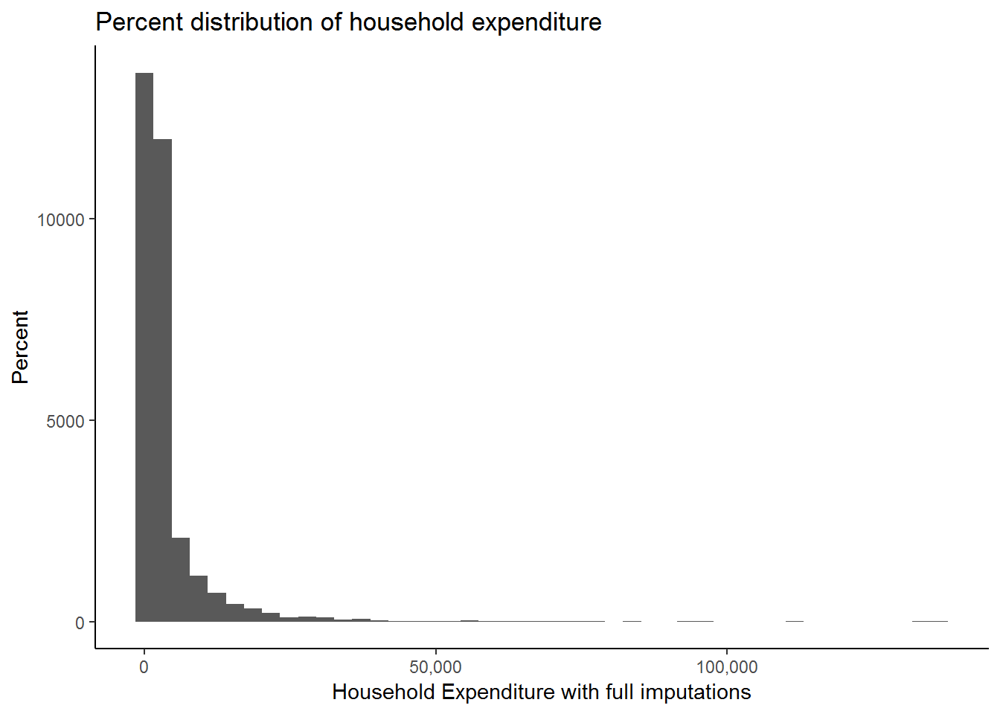
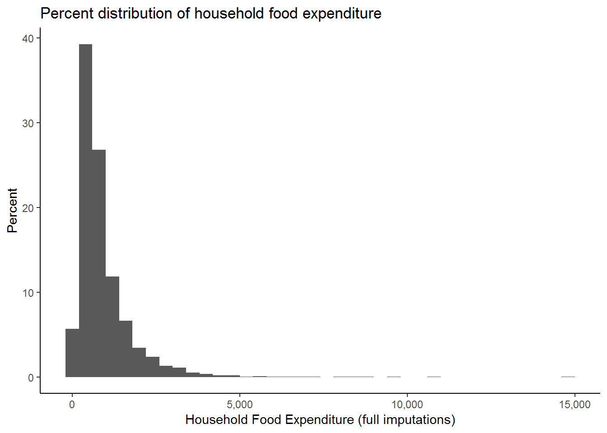
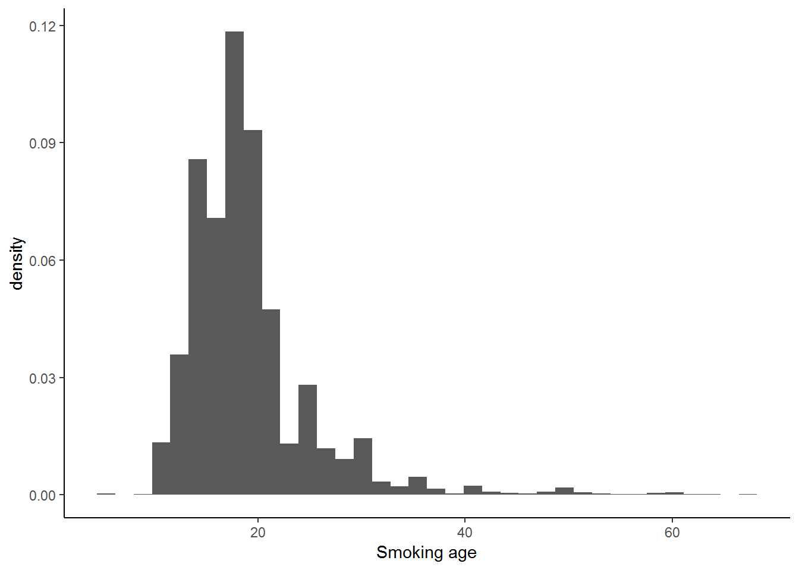
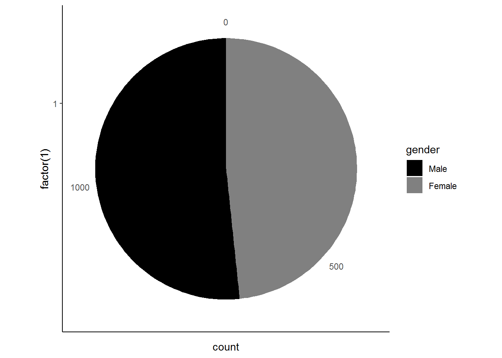
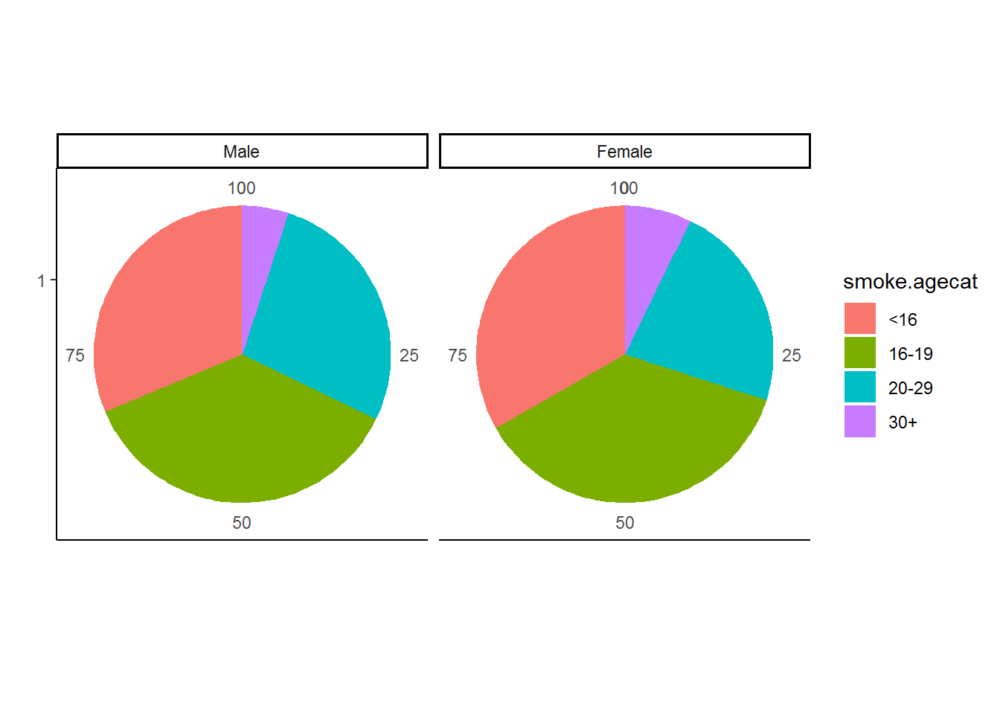
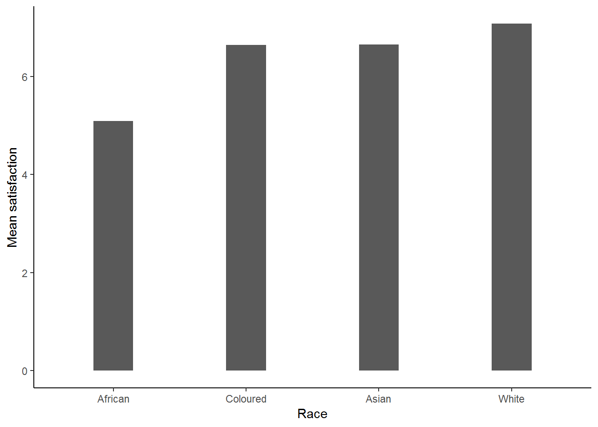
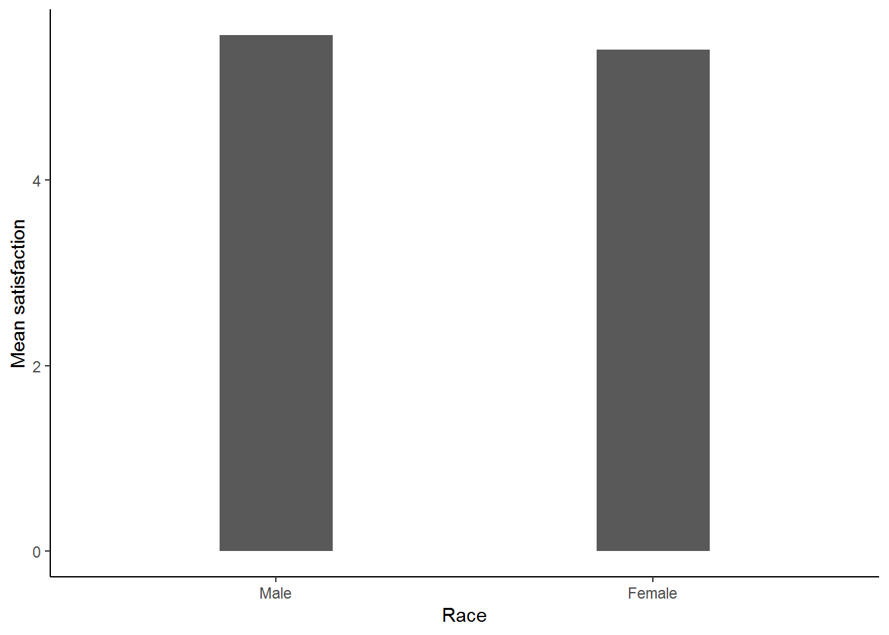
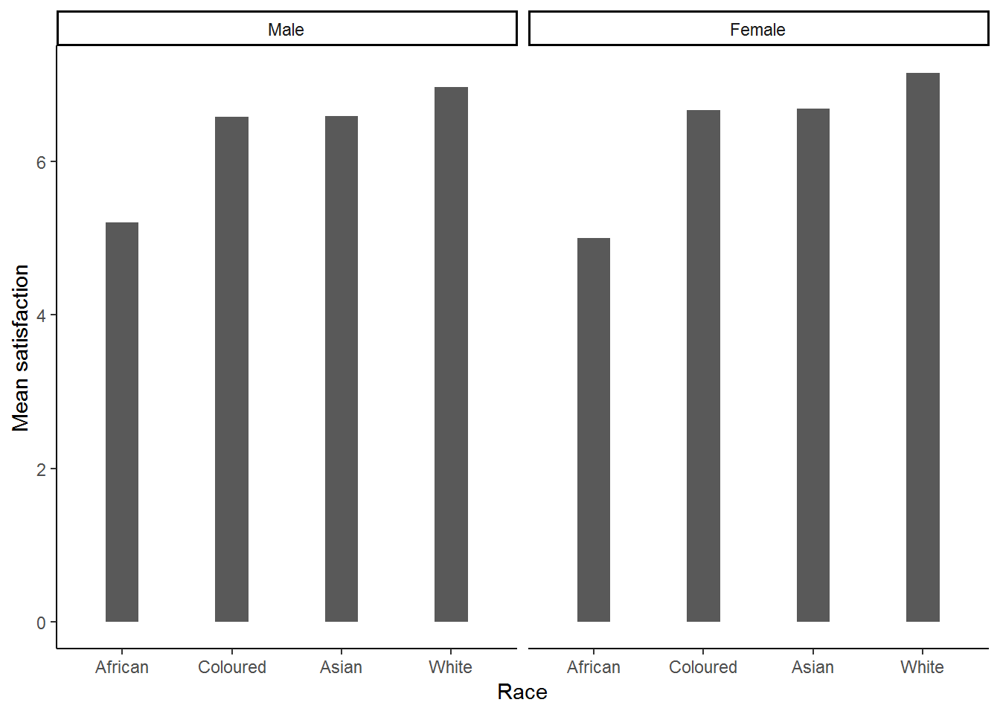

# Understanding graphs

## Introduction

Graphs are often an intuitive and easy‐to‐understand way of summarizing large amounts of information. In principle, descriptive statistics (e.g. the table command) and graphs (e.g. a pie graph) can convey the same information. Often, though, graphs are more readily interpreted. If we are trying to convey information to a colleague with limited (or no) quantitative training, a graph sometimes will be more effective than a table. But graphs are not only a good way to express information to those without statistical training! Even for those who are statistically sophisticated, graphs are often a wonderful way to get a quick feel for the information contained in the data set. In fact, open almost any newspaper, government publication or corporate report and the chances are good that you'll see graphs of some sort featured prominently.

R has an extensive set of graphing options that allow us to generate and customize a wide variety of graphs to suit our specific needs.

There are different ways of making graphs in R. Among the common ways is `base` or traditional R graphics package, `lattice` add-on package and `ggplot2` add-on package [@R-ggplot2]. In this guide, we made a choice to use `ggplot2`.

`ggplot2` was created by [Hadley Wickham](https://www.amazon.com/ggplot2-Elegant-Graphics-Data-Analysis/dp/331924275X/ref=as_li_ss_tl?ie=UTF8&linkCode=sl1&tag=ggplot2-20&linkId=4b4de5146fdafd09b8035e8aa656f300) and is a family member of the [tidyverse](https://ggplot2.tidyverse.org/). It is based on "The Grammer of Graphics" - [Leland Wilkinson](https://www.amazon.com/Grammar-Graphics-Statistics-Computing/dp/0387245448). `ggplot2` uses layer elements to build a graphic, i.e., it uses an underlying "grammar" to build graphs component-by-component rather than providing premade graphs. It is easy enough to use without any exposure to the underlying grammar.

Useful resources for starting to learn `ggplot2` include:

* [gglot2 Documentation](http://ggplot2.tidyverse.org/) (particularly the [function reference](http://ggplot2.tidyverse.org/reference/index.html)).

* [Data Visualization Chapter of R for Data Science Book](http://r4ds.had.co.nz/data-visualisation.html)

* RStudio’s ggplot2 [cheat sheet](https://www.rstudio.com/wp-content/uploads/2015/03/ggplot2-cheatsheet.pdf)

* [R Graphics Cookbook](http://www.cookbook-r.com/Graphs/)

* [UCLA's](https://stats.idre.ucla.edu/r/seminars/ggplot2_intro/) introduction to `ggplot2`.


## Getting ready

We begin this chapter by asking you to run the following lines of code. Please copy the following lines of code into an R script file and then run it before you begin the chapter. Make sure that you remember what each line of code is doing.


```r
library(tidyverse)
library(foreign)
nids<-read.dta("./data/nids.dta", convert.factors=FALSE)

nids <- nids%>%
  arrange(hhid, pid)%>%
  #Tag hhid
  group_by(hhid) %>%
  mutate(hhrestrict = 1:n()) %>%
  mutate(hhrestrict = ifelse(hhrestrict==1,1,0))
```


```r
#We rename some variables for ease of use.
nids<-nids %>% 
 mutate(race = w1_best_race,
        age = w1_r_best_age_yrs,
        gender = w1_r_b4,
        province = w1_hhprov, 
        hhincome = w1_hhincome) %>% 
  mutate(gender = factor(gender, levels = 1:2, labels = c("Male", "Female")),
         race = factor(race, levels = 1:4, labels = c("African", "Coloured","Asian", "White")),
         province = factor(province, levels=1:9, labels = c("Western Cape","Eastern Cape","Northern Cape","Free State","KwaZulu-Natal","North West","Gauteng","Mpumalanga","Limpopo")),
         w1_hhgeo = factor(w1_hhgeo, levels = 1:4, labels = c("Rural formal", "Tribal authority areas","Urban formal", "Urban informal")))
```

## ggplot2 and its elements

There is no graph menu for `ggplot2`, so we need to write code instructing R what to do. Since this is not an introduction to ggplot2, we will try to answer specific questions and less description on `ggplot2`. You can check with some of the highlighted resources for `ggplot2`.

`ggplot2` requires three essential elments to plot a graphic. These are:

* **data (data)**: variables mapped to aesthetic features of the graph.

* **aesthetic (aes)**: mapping between variables to their visualization.

* **geometric (geom)**: objects/shapes you add as layers to your graph.

The ggplot2 commands at the least looks like:

`ggplot(data=df, aes(x = ,y = )) + geom_*()`

where:

`df` - is your data frame

`x` and `y` - are variables to be mapped depening on graph type, and 

`geom_*` - is for any one of:

  * `geom_point` for drawing individual points (e.g., a scatter plot)
  
  * `geom_line` for drawing lines (e.g., for a line charts)
  
  * `geom_smooth` for drawing smoothed lines (e.g., for simple trends or approximations)
  
  * `geom_bar` for drawing bars (e.g., for bar charts)
  
  * `geom_histogram` for drawing binned values (e.g. a histogram)
  
  * `geom_polygon` for drawing arbitrary shapes
  
  * `geom_boxplot`: boxes-and-whiskers
  
  * `geom_errorbar`: T-shaped error bars
  
  * `geom_ribbon`: bands spanning y-values across a range of x-values

Each of these geometries will leverage the aesthetic mappings supplied although the specific visual properties that the data will map to will vary.


## Histograms

Histograms are a graphical tool that tell us the fraction (or percent) of observations, for any given variable, that fall within different ranges. Histograms are used for continuous variables. For example, if we have a continuous variable such as income, a histogram will tell us what percentage or fraction of the sample fall into different income 'bins' or 'groups'. We will present the basics of graphing histograms in R by working through the example we present below.

### Graphing economic wellbeing in South Africa in 2008

Suppose we are interested in investigating the distribution of economic well‐being in South African. The first question we need to answer is what variable should we use as a measure of economic well‐being? Perhaps the first thoughts that come to mind are variables relating to household income or even assets owned? However when looking at survey data, economists tend to use a measure of expenditure rather than measures of income or assets. There are a number of reasons for this: firstly expenditure is far less variable than income, especially in rural areas (in fact, in rural areas income can vary greatly depending on when the survey is administered) and secondly, a good measure of assets is very hard to capture in a survey, for example one of the biggest assets that a household may have is its house, but it is very hard to get good data on the value of a house. So let’s go ahead and graph a histogram of total monthly expenditure for the household.


```r
ggplot(data=nids, aes(x = w1_h_expenditure)) + geom_histogram()
```

```
## `stat_bin()` using `bins = 30`. Pick better value with `binwidth`.
```


The above commands match the basic commands introduced above. We can tidy the graph a little bit more, for example, change `binwidth`, x-axis scale and format, x-axis (`xlab`) and y-axis (`ylab`) titles, the main title (`ggtitle`) and plot background (`theme_classic`). Here, we are going to make use of the `scales` library [@R-scales] to format the axis scales.


```r
library(scales)
ggplot(data=nids, aes(x = w1_h_expenditure)) +
  geom_histogram(binwidth = 3100) +
  scale_x_continuous(breaks=seq(0,150000,50000), labels = comma) + 
  xlab("Household Expenditure with full imputations") +
  ylab("Percent") +
  ggtitle("Percent distribution of household expenditure") +
  theme_classic()
```



Now let’s analyze the graph we have produced. What does this graph tell us about expenditure and economic well‐being? As it stands this graph doesn’t seem very useful for interpretation; it has such a long x‐axis (R0 to R150 000)! Why would this be the case? The answer is that we have a number of large outliers. A small number of observations report extremely large expenditure values which may have been due to extremely large once off purchases. To cope with this type of variability, economists tend to ‘zone in’ on food expenditure; monthly food expenditure tends not to vary greatly and is less likely to have any outliers (even Bill Gates can only eat so much!). In addition, because of its relatively small variability it is also easier to pick
up the difference between a legitimate outlier and a miscode when it comes to food expenditure. Thus, let’s proceed with our analysis but using food expenditure.

The food expenditure variable is `w1_h_expf`. For ease of reference we are going to rename this variable: 


```r
nids<-rename(nids, food = w1_h_expf) 
```

Let proceed to graphing our new variable, `food`.

When we graphed household expenditure we didn’t control for the number of people in the household, this meant that we were counting large households more times than smaller ones. As we have discussed before this creates a bias in our analysis and we do not want to make the same mistake when graphing our food variable. We therefore need to add our `hhrestrict`
qualifier to control for the household size (and thus, number bias). We need to control for household size by subsetting on `hhrestrict`, i.e. `hhrestrict==1`:

We can chain the `dplyr` functions to filter and then plot using `ggplot2` as follows:


```r
nids%>% 
  filter(hhrestrict==1) %>% 
  ggplot(., aes(x = food, y = (..count..)/sum(..count..)*100)) +  # to create a density
  scale_x_continuous(breaks=seq(0,15000,5000), labels = comma) + 
  geom_histogram(binwidth = 400) +
  xlab("Household Food Expenditure (full imputations)") +
  ylab("Percent") +
  ggtitle("Percent distribution of household food expenditure") +
  theme_classic()
```



While this graph is more informative, we still seem to have some outliers. It would be interesting to find out how many households have expenditure above R5000. To do this we can type:


```r
nids%>%filter(food>5000 & hhrestrict==1) %>%nrow
```

```
## [1] 25
```
You should get an answer of 25. Since 25 is not too large a number out of the 7305 observations we have for food expenditure, let’s restrict our graph to only those spending under R5000 on food.


```r
nids%>%
  filter(food<5000 & hhrestrict==1)%>% 
  ggplot(., aes(x = food, y = (..count..)/sum(..count..)*100)) + 
  scale_x_continuous(breaks=seq(0,5000,1000), labels = comma) + 
  geom_histogram(binwidth = 130) +
  xlab("Household Food Expenditure (full imputations)") +
  ylab("Percent") +
  ggtitle("Percent distribution of household food expenditure") +
  theme_classic()
```


We can customise the above graph even more to make the title more informative and to include important additional information such as the source of the data used.


```r
nids%>%
  filter(food<5000 & hhrestrict==1)%>% 
  ggplot(., aes(x = food, y = (..count..)/sum(..count..)*100)) + 
  scale_x_continuous(breaks=seq(0,5000,1000), labels = comma) + 
  geom_histogram(binwidth = 130) +
  labs(x = "Expenditure in Rand", 
       y = "Percent",
       title = "Total Monthly Household Food Expenditure \n (full imputations)", 
       caption="Source: 2008 data from National Income Dynamics Study") +
  theme_classic()
```


This is much better!

We can see that our graphing has already improved substantially. This graph tells us, among other things, that total monthly food expenditure is concentrated below R2000 and that values around and below R1000 per month are very frequent. We could be more specific if we estimated the fraction of the observations in each bin below the R1000 mark. For example, it appears that about percent 70% of the observations are below R1000 per month.

### Facetting

Faceting splits the data into subsets to create multiple variations of the same graph (paneling).

Let’s take our analysis a step further and ask the question: Does this graph look the same for Indian/Asians and Africans? We can establish the answer using the `facet_*` (`facet_wrap` or `facet_grid`). In the following commands, we filter food expenditure, restricting household size and non missing race (`filter(w1_h_expf<5000 & hhrestrict==1 & !is.na(w1_best_race))`) before plotting the previous graph and facet by race (`facet_wrap(~w1_best_race, ncol=2)`).


```r
nids%>%
  filter(food<5000 & hhrestrict==1 & !is.na(race))%>%
  ggplot(., aes(x = food, y = ..density..)) + 
  scale_x_continuous(breaks=seq(0,5000,1000), labels = comma) + 
  geom_histogram(binwidth = 130) +
  labs(x = "Expenditure in Rand", 
       y = "Density",
       title = "Total Monthly Household Food Expenditure \n (full imputations)", 
       caption="Source: 2008 data from National Income Dynamics Study") +
  scale_y_continuous(labels = percent_format()) +
  facet_wrap(~race, ncol=2) +
  theme_classic()
```


We now see how the distribution of food expenditure varies by racial group. `ggplot2` repeats the graph for each of the categories of the variable that we specify (i.e. race), making comparison between the groups far easier!


## Worked example 1: What is the most common age at which people start smoking?

Data analysis can be a tricky business. In most cases answering a research question will require careful and systematic exploration of the data before we can even begin to think about running regressions and using higher level statistical analysis. Graphs are often a good way to get to know your data! But you need to know which graph to use. The worked examples we present in this chapter are intended to not only refine your graphing skills, but also give you some idea of how we need to scrutinize variables before we go ahead and use them blindly. The worked examples share a common focus on issues of health. In this first example we want to establish the most common age at which people start smoking.

In the health themed examples we focus on adults, thus we want to restrict our sample to individuals aged 20 or older. To do this we create a new dummy variable which has a value of one for a respondent of age 20 and above, and a 0 otherwise.


```r
nids<-nids %>%
  mutate(adult20 = ifelse(age>=20 & !is.na(age),1,0))
```

In the NIDS adult questionnaire, question J29 asks "How old were you when you first smoked cigarettes regularly?" In the data is called `w1_a_j29`.


```r
nids%>%
  ungroup() %>% 
  filter(adult20==1) %>%
  select(w1_a_j29) %>%
  summary
```

```
##     w1_a_j29    
##  Min.   :-9.00  
##  1st Qu.:15.00  
##  Median :17.00  
##  Mean   :16.14  
##  3rd Qu.:20.00  
##  Max.   :67.00  
##  NA's   :13317
```

Let’s dig a bit further and examine this question in the adult questionnaire. From the **a** in the variable name tells us that only people who answered the adult questionnaire should have a value for this variable. The questionnaire tells us that adult respondents were only meant to be asked question J29 if they currently smoke (J26==1) or have ever smoked (J27==1). Is the data we have in line with this? Do check we need to construct an ever-smoked variable which tells us which individuals currently smoke or have ever smoked?


```r
nids<-nids%>%
  mutate(eversmoke = ifelse((w1_a_j26==1 | w1_a_j27==1) & adult20==1,1,0))
```

Thus, when `eversmoke==1` the person answered yes to J26 or J27. Now we want to check if there are there any respondents who answered J29 even though they said they had never smoked:


```r
nids%>%
  filter(!is.na(w1_a_j29) & eversmoke!=1 & adult20==1) %>%
  nrow
```

```
## [1] 51
```

So there are 51 observations where respondents gave an answer to J29 even though they had previously said they never smoke. Next we check whether these 51 observations were valid answers or whether they were simply coded with negative non-response codes,


```r
nids%>%
  filter(!is.na(w1_a_j29) & eversmoke!=1 & adult20==1)%>%
  select(w1_a_j29)
```

```
## Adding missing grouping variables: `hhid`
```

```
## # A tibble: 51 x 2
## # Groups:   hhid [49]
##      hhid w1_a_j29
##     <int>    <int>
##  1 101100       -8
##  2 101929       -3
##  3 101954       -3
##  4 102772       11
##  5 103120       -3
##  6 103151       -3
##  7 103210       51
##  8 103317       -3
##  9 103333       -3
## 10 103421       -3
## # ... with 41 more rows
```

Most of values are assigned a missing code. But there are 5 cases where a valid age is given.
What would you do with these respondents?

Now let’s consider the non-response categories. From the documents, we know what values are assigned to "Don’t know", "Refused", "Not applicable" and "Missing". The non-responses are all given negative values. How many people did not give valid ages in response to this question of when they started smoking?


```r
nids%>%
  filter(w1_a_j29 <0 & adult20==1)%>%
  nrow
```

```
## [1] 455
```

We will want to exclude these negative observations from our analysis, so let’s create a new variable called `smoking_age` that only contains the non-negative responses. We also restrict the variable to only include adults over the age of 20.


```r
nids<-nids%>%
  mutate(smoking_age = ifelse(w1_a_j29 > 0 & !is.na(w1_a_j29) & adult20==1,w1_a_j29,NA))
```

Now we can try and answer our question: What is the most common age at which people in the sample started smoking? While our `smoking_age` variable is categorical, it takes many different values and therefore a histogram might be best to illustrate the distribution. Go ahead and graph this variable, you will need to refine the x-axis labels to see the age where most people start smoking. You should get something like the graph below:


```r
ggplot(nids, aes(x=smoking_age, y = ..density..)) +
  geom_histogram(binwidth = 1.7714286) +
  xlab("Smoking age") +
  theme_classic()
```

```
## Warning: Removed 27895 rows containing non-finite values (stat_bin).
```



From the histogram it is evident that the most common ages for people to start smoking are those between 15 and 18.

Now we consider whether there are differences between the age at which males and females start smoking. The best way to see this is by generating a new histogram, facetting by gender (go ahead and to this). Your graph should look something like the one below:

**Density**


```r
nids %>% 
  ggplot(., aes(x=smoking_age, y = ..density..)) +
  geom_histogram(binwidth = 1.7714286) + #binwidth chosen to replicate the stata output
  xlab("Smoking age") +
  facet_wrap(~gender) +
  theme_classic()
```

```
## Warning: Removed 27895 rows containing non-finite values (stat_bin).
```


**Proportion**


```r
#ggplot(nids, aes(x=smoking_age, y = (..count..)/sum(..count..))) +
#  geom_histogram(binwidth = 1.7714286) +
#  xlab("Smoking age") +
#  facet_wrap(~gender)
```


Let’s inspect the histogram. The distributions don’t seem to differ much by gender. One interesting thing to notice is that there are spikes at age 25 and age 30 in the female distribution on the right. Is it likely that substantially more females started smoking at age 25 than at age 24 or at age 30 instead of age 29?

No. While a few might find 30 a depressing age, the most likely explanation is that people can’t remember the exact age at which they started smoking and so they approximate it with the closest age that is a multiple of 5 or 10 (Remember, the people getting asked when they started smoking might be 31 or they might by 91 years old). This is called 'age heaping' and is a common phenomenon in the reporting of ages in surveys. It is useful to be aware of it.

Now go ahead and try the following questions on your own!


**1. Find a variable that gives the number of people that belong to each household. Use it to create a new variable for food expenditure per person, called foodpc and label this variable "per capita food expenditure".**

Question 1 Answer

**2. Generate a histogram of household per capita food expenditure. How many households spend above R2000 per person? Graph a histogram excluding households that spend above R2000 per person. What would this histogram have looked like if we had instead considered foodpc at the individual level?**
Question 2 Answer

**3. Generate a histogram of household per capita food expenditure by gender of the resident household head (for foodpc < 2000). Comment on your findings.**
Question 3 Answer


## Pie charts

Similar to Histograms, pie graphs are graphical tools which inform the reader of the distribution of any particular variable. In contrast to histograms, however, Pie graphs are used for categorical variables only.

Here we introduce pie charts for completeness only as they are considered not to be a good way of presenting information. 

## Investigating newborn and infant gender

We will start our explanation of pie charts with an easy example: suppose we want to know whether there are an equal number of men and women in South Africa, one way we could find out is by producing a pie chart for gender. (Note, however, that we will need to ask ourselves whether our sample is perfectly representative of the South African population)

In ggplot2, a pie chart is emplemented as a bar chart on a polar coordinate system. We create the pie chart as follows:


```r
ggplot(nids, aes(x = factor(1), fill = gender)) +
  geom_bar(width = 1) + coord_polar(theta = "y") + 
  scale_fill_grey(start=0, end=0.5) +
  theme_classic()
```


The pie chart tells us that there are more women than men in South Africa!

**Subsetting**

Now suppose we want to dig a bit deeper and investigate the gender distribution of new-borns and infants in South Africa. To do this we need to subset the `age` variable for being either 0 or 1.


```r
nids%>%
  filter(age==0 | age==1)%>%
  select(gender)%>%
  ggplot(., aes(x = factor(1), fill = gender)) +
  geom_bar(width = 1) + 
  coord_polar(theta = "y") + 
  scale_fill_grey(start=0, end=0.5)+
  theme_classic()
```

```
## Adding missing grouping variables: `hhid`
```



The pie chart reveals that the majority of infants are male. These results are rather interesting if we compare them to our first pie chart! What do you think might explain the difference between the two graphs? It might be that there is or has been a mortality differential between men and women, where more female infants grow into adults. Can you think of any other explanations?

### Exploring the distribution of race across provinces

We now turn our attention to the race variable. Suppose we are interested in assessing whether the distribution of race varies significantly over different provinces or perhaps we would like to know which province has the largest Indian/Asian population. Pie charts can be particularly informative in this case since there are 9 separate categories (i.e. the provinces) for which we will need to compare distributions of race! We proceed as follows:


```r
nids %>% 
  group_by(province,race) %>% 
  summarise(freq=n()) %>% 
  group_by(province) %>% 
  mutate(percent = round(freq/sum(freq)*100,2))  %>% 
  ggplot(., aes(x=factor(1), y=percent, fill = race)) +
  geom_bar(stat = "identity",width = 1) +
  facet_wrap(~province) +
  labs(x="",y="") +
  coord_polar(theta = "y") +
  theme_classic()
```


There are some people with unknown race, exclude by filtering them out (`na.omit`) to produce:


```r
nids %>% 
  group_by(province,race) %>% 
  summarise(freq=n()) %>% 
  na.omit() %>% 
  group_by(province) %>% 
  mutate(percent = round(freq/sum(freq)*100,2))  %>% 
  ggplot(., aes(x=factor(1), y=percent, fill = race)) +
  geom_bar(stat = "identity",width = 1) +
  facet_wrap(~province) +
  labs(x="",y="") +
  coord_polar(theta = "y") +
  theme_classic()
```


Examine the graph and try to answer the questions we posed above. It should be relatively easy to see the relevant answers. Firstly, we see that the Western and Northern Cape have rather different racial compositions in comparison to the other 7 provinces. In particular, they have many more coloured residents and a comparatively smaller percentage of African residents. Secondly, we see that either Kwa‐ Zulu Natal or the North West have the largest fraction of Indian/Asians. 

### Urban vs. rural, where are South Africans living?

We investigate the distribution of the urban or rural location of a given household (given by the `w1_hhgeo` variable) as a way to show how we can format our pie charts to make them more presentable. As with any other analysis, we must know what the variable we're working with "looks" like. In our case, we can do this by simply tabulating `w1_hhgeo`.


```r
table(nids$w1_hhgeo)
```

```
## 
##           Rural formal Tribal authority areas           Urban formal 
##                   3010                  14114                  12048 
##         Urban informal 
##                   1998
```

Or


```r
nids %>% 
  group_by(w1_hhgeo) %>% 
  summarise(freq=n()) %>%
  mutate(percent = round(freq/sum(freq)*100,2), cum_percent = round(cumsum(freq)/sum(freq)*100,2))
```

```
## # A tibble: 4 x 4
##   w1_hhgeo                freq percent cum_percent
##   <fct>                  <int>   <dbl>       <dbl>
## 1 Rural formal            3010    9.66        9.66
## 2 Tribal authority areas 14114   45.3        54.9 
## 3 Urban formal           12048   38.6        93.6 
## 4 Urban informal          1998    6.41      100
```

Now that we have a sense of what to expect we turn our attention to graphing this variable.


```r
nids%>%
  ggplot(., aes(x = factor(1), fill = w1_hhgeo)) +
  geom_bar(width = 1) + 
  coord_polar(theta = "y")+
  theme_classic()
```


We see that the greatest fraction of the NIDS households is located in Urban Formal settings.

## Worked example 2: Are there differences between the age at which men and women start smoking?

We return to our earlier example where we considered the age at which respondents started smoking using the smoking_age variable. In the previous example we generated a histogram of the `smoking_age` variable. However, it might also be useful to look at more aggregated age categories to find out what percentage of smokers start smoking before age 16 (the legal age an individual can purchase tobacco), in their late teens, their twenties or later in life. To do this we need to generate a new variable separating the `smoking_age` variable into the categories <16, 16‐19, 20‐29 and 30+.


```r
nids$smoke.agecat<-NA
nids$smoke.agecat[which(nids$smoking_age>=0 & nids$smoking_age<=15)]<-1
nids$smoke.agecat[which(nids$smoking_age>16 & nids$smoking_age<=19)]<-2
nids$smoke.agecat[which(nids$smoking_age>20 & nids$smoking_age<=29)]<-3
nids$smoke.agecat[which(nids$smoking_age>30 & nids$smoking_age<=67)]<-4

nids$smoke.agecat<-factor(nids$smoke.agecat, levels = 1:4, labels = c("<16","16-19","20-29","30+"))
```

Now we can graph this variable using a pie chart (go ahead and do it yourself in R). What is this graph telling us? Compare it to the histogram we produced in Worked Example 1 – which is more informative in this instance?


```r
nids%>%
  filter(!is.na(smoke.agecat))%>%
  ggplot(., aes(x = factor(1), fill = smoke.agecat)) +
  geom_bar(width = 1) + 
  coord_polar(theta = "y")+
  theme_classic()
```


Suppose, however, that we would also like to consider men and women separately. We do this by re‐running the graph and faceting by gender. The code is once again presented below.


```r
nids %>% 
  group_by(gender,smoke.agecat) %>% 
  summarise(freq=n()) %>% 
  na.omit() %>% 
  group_by(gender) %>% 
  mutate(percent = round(freq/sum(freq)*100,2))  %>% 
  ggplot(., aes(x=factor(1), y=percent, fill = smoke.agecat)) +
  geom_bar(stat = "identity",width = 1) +
  facet_grid(.~gender) +
  labs(x="",y="") +
  coord_polar(theta = "y")+
  theme_classic()
```




Looking at this pie chart we see that around a quarter of both male and female smokers started smoking before the age of 16 – in other words before the age at which they were legally allowed to buy tobacco. We also see that the majority of smokers start smoking by their late teens. Very few smokers started smoking after the age of 30. This is very useful in that it tells policy makers who wish to reduce the incidence of smoking in South Africa that they should target teenagers in their campaigns.

How many people in the sample started smoking before the legal age at which they were allowed to buy tobacco (16 in South Africa)?


```r
nrow(subset(nids, subset=smoke.agecat=="<16"))
```

```
## [1] 787
```

Is there age heaping at age 18, the legal age of drinking in South Africa?


```r
nrow(subset(nids, subset=smoking_age==17))
```

```
## [1] 251
```

```r
nrow(subset(nids, subset=smoking_age==18))
```

```
## [1] 436
```

```r
nrow(subset(nids, subset=smoking_age==19))
```

```
## [1] 214
```

Around double the number of people say they started smoking at 18 compared to either 17 or 19.


### Exercise

**4. Create a categorical variable called Poverty and set it equal to 1 if income is less than 800 and zero otherwise(i.e. we are looking at households in the lowest 10% of the income variable). Is Poverty a household or individual level variable? Graph the fraction of households in poverty by province. Now, can you make the “Income < 800” category explode from the rest of the pie chart?**

Question 4 Answer

**5. Find the satisfaction variable and rename it “Satisfaction”. Is satisfaction an individual or household level variable? Create a pie chart with Satisfaction as the categorical variable across race, (excluding non‐response values). Is this graph effective?**

Question 5 Answer


## Bar graphs

Question 5 above demonstrated why it may not always be optimal to use a pie chart, especially when we have a large number of categories. In this case the Bar Graph can be a useful alternative option. Bar charts can be used not only for categorical variables but also for continuous variables. The reason for this is that the bar chart is quite diverse in its applicability as it allows us to incorporate summary statistics in our graphs.

### Investigating Satisfaction levels in South Africans

As an example let’s generate a bar graph investigating how the `satisfaction` variable might differ by race (NB: Make sure that you have done question 5 or you won’t have the `satisfaction` variable).

**Q5**


```r
nids<-nids%>%
  mutate(satisfaction = ifelse(w1_a_m5>=1, w1_a_m5, NA))
```

The code that generated this graph:


```r
nids%>%
  group_by(race)%>%
  summarise(msatis = mean(satisfaction, na.rm=TRUE))%>%
  ggplot(., aes(x = race, y = msatis)) + geom_bar(stat = "identity", width=.3) +
  xlab("Race") + ylab("Mean satisfaction") +
  theme_classic()
```


Filter missing race:


```r
nids%>%
  filter(!is.na(race))%>%
  group_by(race)%>%
  summarise(msatis = mean(satisfaction, na.rm=TRUE))%>%
  ggplot(., aes(x = race, y = msatis)) + geom_bar(stat = "identity", width=.3) +
  xlab("Race") + ylab("Mean satisfaction") +
  theme_classic()
```




This graph is telling us the mean satisfaction level for each of the race groups. This gives us the information that we are looking for and we can conclude that Whites have the highest level of satisfaction on average, followed by Coloureds and Asian/Indians who share virtually the same mean satisfaction level, while the least satisfied are Africans.

Now let us consider satisfaction over gender. Do you think it is likely that one gender has a higher mean level of satisfaction than the other? Let’s take a look:

To graph satisfaction over gender we simply do the following:


```r
nids%>%
  group_by(gender)%>%
  summarise(msatis = mean(satisfaction, na.rm=TRUE))%>%
  ggplot(., aes(x = gender, y = msatis)) + geom_bar(stat = "identity", width=.3) +
  xlab("Race") + ylab("Mean satisfaction") +
  theme_classic()
```



This graph implies that there is not a large difference between men and women when it comes to satisfaction. One of the most useful features of a bar graph is that we can compare across a variety of categories. For instance, let us now consider satisfaction across race and gender. To do this simply:


```r
nids%>%
  filter(!is.na(race))%>%
  group_by(race, gender)%>%
  summarise(msatis = mean(satisfaction, na.rm=TRUE))%>%
  ggplot(., aes(x = race, y = msatis)) + geom_bar(stat = "identity", width=.3) +
  xlab("Race") + ylab("Mean satisfaction") +
  facet_wrap(~gender, ncol=2) +
  theme_classic()
```



Clearly this graph is in need of some formatting. Below we change the angle of the group 1 labels, add titles, etc.


```r
nids%>%
  filter(!is.na(race))%>%
  group_by(race, gender)%>%
  summarise(msatis = mean(satisfaction, na.rm=TRUE))%>%
  ggplot(., aes(x = race, y = msatis)) + geom_bar(stat = "identity", width=.5) +
  labs(x = "Population group", y = "Satisfaction Scale (1 - 10)",title = "Mean Satisfaction \n by Race and Gender") +
  facet_wrap(~gender, ncol=2) +
  geom_text(aes(label=round(msatis,2)), vjust=1.4, color="white") +
  theme_classic() 
```


This is much better! It seems as if the differences that we saw between races persist when we also categorize by gender. In fact, there seems to be very little difference between males and females within each racial category. Clearly race is more closely associated with reported satisfaction in South Africa than gender is. We could also put gender in group 1 and race in group 2 to get essentially the same graph, but represented in a different way:


```r
nids%>%
  group_by(race, gender)%>%
  summarise(msatis = mean(satisfaction, na.rm=TRUE))%>%
  na.omit() %>% 
  ggplot(., aes(x = gender, y = msatis)) + geom_bar(stat = "identity", width=.5) +
  labs(x = "Population group", y = "Satisfaction Scale (1 - 10)",title = "Mean Satisfaction \n by Race and Gender") +
  geom_text(aes(label=round(msatis,2)), vjust=1.4, color="white") +
  ggtitle("Mean Satisfaction \n by Race and Gender") +
  facet_grid(~race) +
  theme_classic()
```


This graph places a greater emphasis on the comparison of males and females within racial categories, while the previous one placed a greater emphasis on comparing the satisfaction levels of different racial categories amongst men and women separately.


### Worked example 3: Does the frequency of alcohol consumption vary by gender, race or religion?

The NIDS dataset includes questions on both the frequency and quantity of alcohol consumption. In this worked example we make use of bar graphs to find out whether the frequency of alcohol consumption differs by gender or religious affiliation.

From the questionnaire, this coresponds to question `j31`. Now, lets investigate the `w1_a_j31` variable (remember we want to restrict our sample to adults over the age of 20).

<div class="figure">

<p class="caption">(\#fig:alcohol)Labels for alcohol consumption</p>
</div>


```r
nids%>% 
  filter(adult20==1)%>%
  group_by(w1_a_j31)%>%
  summarise(n=n())
```

```
## # A tibble: 11 x 2
##    w1_a_j31     n
##       <int> <int>
##  1       -8     5
##  2       -3    33
##  3        1  7890
##  4        2  1453
##  5        3  1695
##  6        4   461
##  7        5   796
##  8        6   252
##  9        7    96
## 10        8   147
## 11       NA  4219
```

Examining the results from the summarise command above, how many different valid categories are there? What are these responses? If you had written the questionnaire, would you have used the same categories?

Suppose we want to plot a bar graph of this variable so that each category has a different bar in the graph. To do this we need to create 'dummy' variables for each category, representing each of the bars in the bar graph. We could do this by creating a dummy variable for each of the 8 possible values of the `w1_a_j31` variable, but we could also choose our own categories as we do here by grouping the 8 given categories into 4 broader categories.


```r
#
nids$alc<-NA
#People who have never drunk alcohol
nids$alc[nids$w1_a_j31 ==1 & nids$adult20==1]<-1 

#People who drink rarely (no longer, or less than once a week)
nids$alc[(nids$w1_a_j31 == 2 | nids$w1_a_j31 == 3| nids$w1_a_j31==4) & nids$adult20==1]<-2 

#Frequent drinkers: between 1 and 4 days a week.
nids$alc[(nids$w1_a_j31 == 5 | nids$w1_a_j31 == 6) & nids$adult20==1]<-3

#Very frequent drinkers: more than 5 days a week.
nids$alc[(nids$w1_a_j31 == 7 | nids$w1_a_j31 == 8) & nids$adult20==1]<-4
```

Adding labels:


```r
nids<-nids %>%
  mutate(alc = ifelse(adult20==1, alc, NA)) %>%
  mutate(alc = factor(alc, levels = 1:4, labels = c("Never drank alcohol", "Drink rarely","Frequent drinkers", "Very frequent drinkers")))
```

Graphing


```r
nids%>%
  filter(!is.na(alc)) %>%
  ggplot(., aes(x = alc, fill=alc)) +
  geom_bar(aes(y = ..count../sum(..count..))) + 
  xlab("Alcohol consumption") + ylab("Proportion of sample") +
  theme_classic() +
  theme(axis.text.x=element_text(angle=90))
```


With this bar graph we can answer the following questions:

**What proportion of respondents report that they have never drunken alcohol before?**
If we look at the blue column we see that over 60% of the respondents report they have never drunken alcohol before!

**What does the green bar represent?**
It tells us that approximately 25% of the sample has either given up alcohol or consumes it very rarely.

Now, let’s see whether alcohol consumption varies by race. Re-do the previous graph simply


```r
nids%>%
  filter(!is.na(alc) & !is.na(race))%>%
  ggplot(.) +
  stat_count(aes(x= alc, y= ..prop.., group = race)) +
  xlab("Alcohol consumption") + ylab("Proportion of sample") +
  facet_wrap(~race, ncol=2) +
  theme_classic() +
  theme(axis.text.x=element_text(angle=90))
```


 
Are there substantial differences in reported alcohol consumption between racial groups? The majority of Africans and Asians/Indians report no alcohol consumption, while in the White and Coloured population groups, frequent alcohol consumption is far more common.

You may want to know whether alcohol consumption differs by some other characteristic instead of race. With a rich dataset such as the NIDS dataset, it is possible to investigate how various traits of the individual or household influence the variable we are interested in - in this case the frequency of alcohol consumption. In the following question we look at how alcohol consumption varies by gender.

**6. Create a pair of bar graphs which show the frequency of alcohol consumption for men and women (use the alcohol frequency categories we created in the worked example). Is alcohol consumption similar between men and women in SA?**

Question 6 Answer

**7. Use bar graphs to investigate whether religious affiliation influences the frequency with which people consume alcohol.**

Question 7 Answer


## Question answers 


## Session information


```r
print(sessionInfo(), locale = FALSE)
```

```
## R version 3.5.1 (2018-07-02)
## Platform: x86_64-w64-mingw32/x64 (64-bit)
## Running under: Windows 7 x64 (build 7601) Service Pack 1
## 
## Matrix products: default
## 
## attached base packages:
## [1] stats     graphics  grDevices utils     datasets  methods   base     
## 
## other attached packages:
##  [1] scales_0.5.0    bindrcpp_0.2.2  foreign_0.8-70  forcats_0.3.0  
##  [5] stringr_1.3.1   dplyr_0.7.6     purrr_0.2.5     readr_1.1.1    
##  [9] tidyr_0.8.1     tibble_1.4.2    ggplot2_3.0.0   tidyverse_1.2.1
## 
## loaded via a namespace (and not attached):
##  [1] tidyselect_0.2.4 xfun_0.2         reshape2_1.4.3   haven_1.1.2     
##  [5] lattice_0.20-35  colorspace_1.3-2 htmltools_0.3.6  yaml_2.1.19     
##  [9] utf8_1.1.4       rlang_0.2.1      pillar_1.2.3     withr_2.1.2     
## [13] glue_1.2.0       modelr_0.1.2     readxl_1.1.0     bindr_0.1.1     
## [17] plyr_1.8.4       munsell_0.5.0    gtable_0.2.0     cellranger_1.1.0
## [21] rvest_0.3.2      psych_1.8.4      evaluate_0.10.1  labeling_0.3    
## [25] knitr_1.20       parallel_3.5.1   highr_0.7        broom_0.4.5     
## [29] Rcpp_0.12.17     backports_1.1.2  jsonlite_1.5     mnormt_1.5-5    
## [33] hms_0.4.2        digest_0.6.15    stringi_1.1.7    bookdown_0.7    
## [37] grid_3.5.1       rprojroot_1.3-2  cli_1.0.0        tools_3.5.1     
## [41] magrittr_1.5     lazyeval_0.2.1   crayon_1.3.4     pkgconfig_2.0.1 
## [45] xml2_1.2.0       lubridate_1.7.4  assertthat_0.2.0 rmarkdown_1.10  
## [49] httr_1.3.1       rstudioapi_0.7   R6_2.2.2         nlme_3.1-137    
## [53] compiler_3.5.1
```


