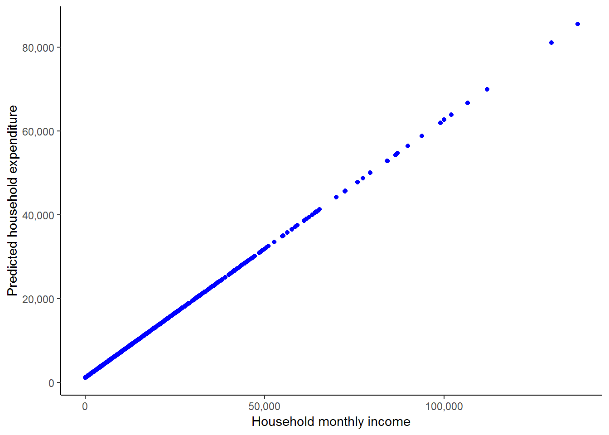
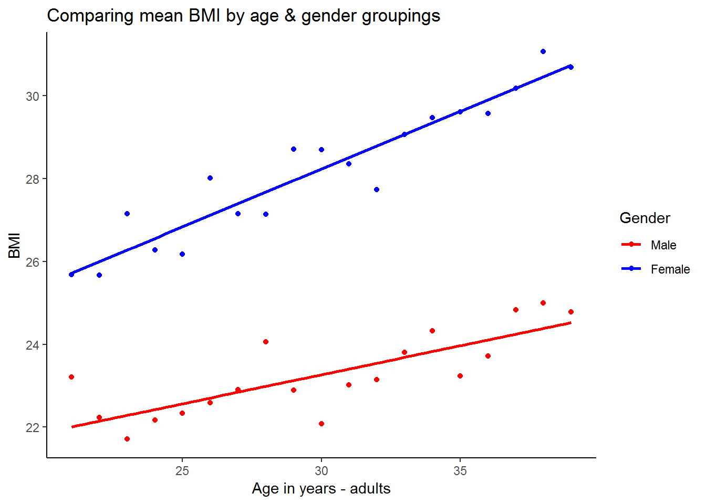
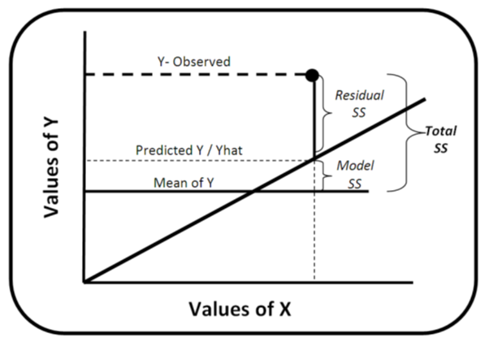

# Simple regression analysis

## Getting ready

In the previous chapters we generated some variables and ran some commands that will influence the results that we get in this chapter. If you are starting a new session of R, please copy the following lines of code into the R script editor and then run it before you begin the chapter. Make sure that you remember what each line of code is doing.


```r
library(foreign)
library(tidyverse)
```

```
## -- Attaching packages --------
```

```
## v ggplot2 3.0.0     v purrr   0.2.5
## v tibble  1.4.2     v dplyr   0.7.6
## v tidyr   0.8.1     v stringr 1.3.1
## v readr   1.1.1     v forcats 0.3.0
```

```
## -- Conflicts -----------------
## x dplyr::filter() masks stats::filter()
## x dplyr::lag()    masks stats::lag()
```

```r
nids<-read.dta("./data/nids.dta", convert.factors=FALSE)

nids<-nids%>% 
  arrange(hhid, pid)%>%
  group_by(hhid) %>%
  mutate(hhrestrict = 1:n()) %>%
  mutate(hhrestrict = ifelse(hhrestrict==1,1,0))


#Class
nids$class<-NA
nids$class[which(nids$w1_fwag<=1500)]<-1
nids$class[which(nids$w1_fwag>1500 & nids$w1_fwag<=4500)]<-2
nids$class[which(nids$w1_fwag>4500)]<-3

nids$class<-factor(nids$class, levels=1:3, labels = c("Lower Class","Middle Class","Upper Class"))


###Creating a BMI variable - from chapter 2 ***

#Height
nids<-nids %>%
  mutate(height = ifelse (w1_a_n1_1 >= 0 & w1_a_best_age_yrs >= 20, w1_a_n1_1/100, NA))

#Weight
nids<-nids %>%
  mutate(weight = ifelse (w1_a_n2_1 >= 0 & w1_a_best_age_yrs > 20, w1_a_n2_1, NA)) 

#BMI
nids<-nids %>%
  mutate(bmi = weight/height^2)

#Valid BMI values
nids<-nids%>%
  mutate(bmi_valid = ifelse(bmi > 15 & bmi < 50,1,NA))

#BMI bins
nids$bmi.bins.nolabel<-NA
nids$bmi.bins.nolabel[which(nids$bmi>=15 & nids$bmi<18.5)]<-1
nids$bmi.bins.nolabel[which(nids$bmi>=18.5 & nids$bmi<25)]<-2
nids$bmi.bins.nolabel[which(nids$bmi>=25 & nids$bmi<30)]<-3
nids$bmi.bins.nolabel[which(nids$bmi>=30 & nids$bmi<=50)]<-4

nids$bmi.bins<-factor(nids$bmi.bins.nolabel, levels=1:4, labels = c("Underweight","Normal", "Overweight", "Obese"))

#Age
nids<-nids%>%
  mutate(age_adult = ifelse(w1_a_best_age_yrs<0,NA, w1_a_best_age_yrs))

#Age bins
nids$age_bins<-NA
nids$age_bins[which(nids$w1_r_best_age_yrs>=20 & nids$w1_r_best_age_yrs<=29)]<-1
nids$age_bins[which(nids$w1_r_best_age_yrs>29 & nids$w1_r_best_age_yrs<=39)]<-2
nids$age_bins[which(nids$w1_r_best_age_yrs>39 & nids$w1_r_best_age_yrs<=49)]<-3
nids$age_bins[which(nids$w1_r_best_age_yrs>49 & nids$w1_r_best_age_yrs<=59)]<-4
nids$age_bins[which(nids$w1_r_best_age_yrs>59 & nids$w1_r_best_age_yrs<=69)]<-5
nids$age_bins[which(nids$w1_r_best_age_yrs>69 & nids$w1_r_best_age_yrs<=120)]<-6

nids$age_bins <- factor(nids$age_bins, levels = 1:6, labels = c("20 - 29 yrs","30 - 39 yrs", "40 - 49 yrs", "50 - 59 yrs", "60 - 69 yrs", "70 - 120 yrs"))

#Rename
nids <- nids%>%
  mutate(race = w1_best_race,
        age = w1_r_best_age_yrs,
        gender = w1_r_b4,
        province = w1_hhprov, 
        hhincome = w1_hhincome) %>% 
  mutate(gender = factor(gender, levels = 1:2, labels = c("Male", "Female")),
         race = factor(race, levels = 1:4, labels = c("African", "Coloured","Asian", "White")),
         province = factor(province, levels=1:9, labels = c("Western Cape","Eastern Cape","Northern Cape","Free State","KwaZulu-Natal","North West","Gauteng","Mpumalanga","Limpopo")),
         w1_hhgeo = factor(w1_hhgeo, levels = 1:4, labels = c("Rural formal", "Tribal authority areas","Urban formal", "Urban informal")))
```

## Introduction

In Chapter 6, you learned methods in R that allowed you to determine whether two variables were statistically related or independent of one another. While this is indeed important, it is often necessary to take your analysis a few steps further to determine the actual relationship between variables.

In this *Simple Regression Chapter*, we will cover the first two methods commonly used to determine the relationship between two variables. The first is correlation analysis, which simply measures the strength or degree of association between two continuous variables. The second is *simple regression analysis*, which allows us to determine how one variable changes in relation to a change in another variable.

In regression analysis, we are often interested in causal relationships. For example, we could be interested in whether political participation depends on individual income? Or we could be interested in whether product advertisement on the Internet leads to higher sales? In general, we are interested in whether variable X has an effect on variable Y. As such, it is often useful to think of variable X as the "independent" or "explanatory" variable and to think of variable Y as the "dependent" variable or as the "effect". However, it is important to note that a regression tests only for an association between the movements of two variables and does not tell us whether one of the variables causes the other.

In this chapter, we will concentrate on the relationship between total monthly household expenditures (`w1_h_expenditure`) and total monthly household income (`w1_hhincome`). Do you think that one of these two variables exerts a causal influence on the other? We might hypothesize that there is a strong causal link between a household’s income and the amount they spend. It makes sense that the more money you receive, the more you will spend. It is your hypothesis which tells you which variable should be your independent variable and which should be your dependent variable.

According to our hypothesis that income has a causal effect on expenditure, expenditure will be the **dependent** variable and income will be the **independent** variable. Once we have used theory and logical reasoning to decide on our hypothesis, we use a regression to test whether there is indeed an association between the relevant variables. And further, to determine the magnitude of the relationship. Below, we will test whether a higher income will be associated with a higher level of expenditure. If it does, we will try to determine how much more a household spends when their income increases.

Since the two variables that we are interested in (`w1_h_expenditure` and `w1_hhincome`) are household-level variables, the first thing that we want to do is to limit the observations to one per household. As we have done in the previous chapters, we need to be careful to use only one observation per household; otherwise we will have the problem of multiple counting. This would lead to larger households having a greater influence on the results than smaller households.

For now, let’s concentrate on the first method we mentioned, correlation analysis. Then we will proceed on to simple regression.

## Correlation of variables

Suppose someone made the statement, "Households that earn 6,000 Rand spend more than households that earn 3,000." This sounds like a reasonable statement to make, however, being the researchers that we are; we want to confirm our intuition with empirical facts. Since we are dealing with two continuous variables and we want to test whether there is a linear relationship (i.e. that a R1 increase in income causes a constant increase in expenditure, regardless of the person’s income level), the appropriate measure of association is a Pearson correlation which in R performs with the `cor` command from the `stats` package.

Note, even if we don’t find a linear relationship, this does not mean the variables are not related. For instance, in this scenario, you might contend that someone who moves from an income of R100 to R150 will probably spend the entire R50 increase, while someone who moves from an income of R10 000 to R10 050 is more likely to save a portion of the R50. If this is the case, then the relationship may be non-linear (the effect of an increase in income on expenditure is different at different income levels). Nevertheless, testing for a linear relationship is generally a very good starting point for analysis.

The Pearson correlation measures the degree to which variables are related or in other words, the degree to which they co-vary. As mentioned above, when using correlation in our analysis, we must make the assumption that the relationship between our two variables is linear. If we suspect otherwise, we should make the proper adjustments to the variable that does not meet the assumption (we will cover this in more detail in Chapter 8). Overall, the initial use of the correlation coefficient is a good way to start investigating whether your intuition about a relationship is remotely correct.

(Notice how we use our `hhrestrict` dummy variable to ensure only one observation per household)

R produces the following results:


```r
cor(nids[nids$hhrestrict==1,c("w1_hhincome","w1_h_expenditure")], use="complete.obs")
```

```
##                  w1_hhincome w1_h_expenditure
## w1_hhincome         1.000000         0.689326
## w1_h_expenditure    0.689326         1.000000
```

Or pipe using `dplyr`


```r
nids %>% 
  filter(hhrestrict==1) %>% 
  ungroup() %>% 
  select(w1_hhincome,w1_h_expenditure) %>%
  cor() #check cor arguments if you want to change the default
```

```
##                  w1_hhincome w1_h_expenditure
## w1_hhincome         1.000000         0.689326
## w1_h_expenditure    0.689326         1.000000
```

R produces the above table, but what does it mean? A correlation value can range from -1 to +1, with 0 indicating that there is no linear association and ±1 being a perfect linear association. If the correlation value is low (near 0), there may still be a non-linear association between the variables of interest.

In our example, you will notice that the coefficient 0.6893 is relatively large and positive. This means that the linear association between our two variables is relatively strong. Thus, as the values of `w1_h_expenditure` increase, so do the `w1_hhincome` values. More clearly, households with a higher total monthly income tend to also have higher total monthly expenditures.

Let’s get back to the original statement, "Households that earn 6,000 Rand spend more than households that earn 3,000." Our initial study of the matter suggests that this is likely to be true, according to our R correlation calculations. This initial approach, however, is too simplistic. R can do much more. We can go further and figure out by exactly how much total monthly household income influences total monthly household expenditure. To do this, we can fit a linear model using the `lm()` command. Before we move on, however, try the following questions:

**1.	What the correlation between the average household’s food expenditure and household size?**

Question 1 Answer

## Outliers

Before we continue on to simple regression analysis, it is a good idea to spend a few minutes reviewing the issue of outliers again. We must be extremely mindful of possible outliers and their adverse effects during any attempt to measure the relationship between two continuous variables. This is particularly true when using methods that rely on the mean of a given variable, as is the case in both correlation and regression analysis. You should recall from an earlier chapter that **means** are extremely sensitive to outliers, whether positively or negatively skewed. Therefore, let’s take a quick look at how our two variables `w1_h_expenditure` and `w1_hhincome` are distributed. Note, it is always a good idea to get a feel for the variables you are using, before jumping into statistical analyses. One simple way to accomplish this is to graph these variables in one scatter plot. Let's try it:


```r
library(scales)
```

```
## 
## Attaching package: 'scales'
```

```
## The following object is masked from 'package:purrr':
## 
##     discard
```

```
## The following object is masked from 'package:readr':
## 
##     col_factor
```

```r
nids%>%
  filter(hhrestrict==1)%>%
  select(w1_h_expenditure, w1_hhincome)%>%
  ggplot(., aes(x = w1_hhincome, y = w1_h_expenditure)) + 
  geom_point() + 
  scale_x_continuous(breaks=seq(0,150000,50000), labels = comma) +
  scale_y_continuous(breaks=seq(0,150000,50000), labels = comma) +
  xlab("Household monthly income - full imputations") + ylab("Household Expenditure with full imputations")+
  theme_classic()
```

```
## Adding missing grouping variables: `hhid`
```


Now, it appears that there is a positive relationship between the two variables as the points with higher income levels tend to also have higher expenditure values. However, a large proportion of the points are concentrated in the lower left-hand corner of the graph and it is very difficult to see what is going on there. It may be the case that the positive relationship is only exhibited by households with high income and expenditure values. In order to get a better idea, we can ask R to include a fitted line which might provide us with a better indication of the relationship between the two variables. The `stat_smooth` function helps us to fit the line as follows: 


```r
nids%>%
  filter(hhrestrict==1)%>%
  select(w1_h_expenditure, w1_hhincome)%>%
  ggplot(., aes(x = w1_hhincome, y = w1_h_expenditure)) + 
  geom_point() + 
  scale_x_continuous(breaks=seq(0,150000,50000), labels = comma) +
  scale_y_continuous(breaks=seq(0,150000,50000), labels = comma) +
  xlab("Household monthly income - full imputations") + ylab("Household Expenditure with full imputations") +
  stat_smooth(method = "lm", se = FALSE, colour = "blue") +
  theme_classic()
```

```
## Adding missing grouping variables: `hhid`
```


We see here that the fitted line is upward sloping which supports our initial conclusion of a positive relationship between expenditure and income. Further, it is informative to think about exactly how R draws a fitted line. Basically it tries to find the straight line that minimizes the ‘distance’ between the all points and the fitted line. Exactly how it does this is beyond the scope of this course. However, the point is that this is essentially a pictorial representation of what a simple linear regression does. It finds the best fit straight line to reflect the relationship between two variables. However, regression analysis is much richer and can give us far more information than just the parameters of the straight line. More on that below, but first let us complete our brief look at outliers by seeing what happens to the straight line when we remove the two outliers circled in red below:


```r
scatter<-nids%>%
  filter(hhrestrict==1)%>%
  select(w1_h_expenditure, w1_hhincome)
```

```
## Adding missing grouping variables: `hhid`
```

```r
ggplot(scatter, aes(x = w1_hhincome, y = w1_h_expenditure)) + 
  geom_point() + 
  scale_x_continuous(breaks=seq(0,150000,50000), labels = comma) +
  scale_y_continuous(breaks=seq(0,150000,50000), labels = comma) +
  xlab("Household monthly income - full imputations") + ylab("Household Expenditure with full imputations") +
  stat_smooth(method = "lm", se = FALSE, colour = "blue") +
  geom_point(data = subset(scatter, w1_h_expenditure > 130000), aes(x = w1_hhincome, y = w1_h_expenditure), colour="red") +
  stat_smooth(data = subset(scatter, w1_h_expenditure < 130000), method = "lm", se = FALSE, colour = "green") +
  theme_classic()
```


A more elegant way of highlighting points using `ggalt` [@R-ggalt] `geom_encircle` function:


```r
library(ggalt)
ggplot(scatter, aes(x = w1_hhincome, y = w1_h_expenditure)) + 
  geom_point() + 
  scale_x_continuous(breaks=seq(0,150000,50000), labels = comma) +
  scale_y_continuous(breaks=seq(0,150000,50000), labels = comma) +
  xlab("Household monthly income - full imputations") + ylab("Household Expenditure with full imputations") +
  stat_smooth(method = "lm", se = FALSE, colour = "blue") +
  stat_smooth(data = scatter %>% filter(w1_h_expenditure < 130000), method = "lm", se = FALSE, colour = "green") +
  geom_encircle(data = scatter %>% filter(w1_h_expenditure > 130000),
                aes(x = w1_hhincome, y = w1_h_expenditure), 
                color="red", 
                size=2, 
                expand=0.01) +
  theme_classic()
```


These two circled households are spending FAR more than their income. This in itself is not a contradiction as it is possible that they are spending wealth that was accumulated in the past or through inheritance. Here, it is simply informative to see how much of an influence they exert on our fitted line, regardless of whether they are valid expenditure values. The green line indicates the fitted line without their influence and while it may seem close to the red line, there is a marked difference considering that we have only excluded 2 out of 7305 observations. We will see below that slope of the red line is 0.615, while the slope of the green line is 0.593. If we interpret these results, we would say in the first case that for every extra rand of income the average household will spend 61.5 cents more. In the second case, they will spend 59.3 cents more. This becomes a sizable difference if we talk about increasing a household’s income by R5000: The first case will predict a R3075 increase in expenditure, while the second case will predict only a R2965 increase in expenditure. This again illustrates the large effect that outliers can have.

A point of caution: You should be extremely wary of deleting data (e.g. in the case of outliers). You must always make sure you have strong reasons for doing so and are not simply doing so because it will give you ‘nice’ results! For instance, here deleting these two circled observations because the households’ expenditures exceed their incomes would be unjustified as many of the other households also spend more than their income (see the graph below).


```r
scatter<-scatter %>% 
  mutate(spend=ifelse(w1_h_expenditure < w1_hhincome,1,2)) %>% 
  mutate(spend=factor(spend, levels=1:2,labels=c("expend<income", "expend>income"))) 

  ggplot(scatter, aes(x = w1_hhincome, y = w1_h_expenditure)) +
    geom_point(aes(x = w1_hhincome, y = w1_h_expenditure, color=spend)) +
    scale_color_manual(values=c("red","blue")) + 
    stat_smooth(method = "lm", se = FALSE, colour = "green") +
    stat_smooth(data = subset(scatter, w1_h_expenditure < w1_hhincome), method = "lm", se = FALSE, colour = "orange") + 
    scale_x_continuous(breaks=seq(0,150000,50000), labels = comma) +
    scale_y_continuous(breaks=seq(0,150000,50000), labels = comma) +
    xlab("Household monthly income") + ylab("Household Expenditure") +
    theme_classic()
```


  
All the blue dots represent households that have a higher expenditure than income. The orange line is the fitted line that we would get if we excluded all of these values. While it may be the case that some of the blue dots are errors, it is highly unlikely that all of them are. Therefore, we would have been unjustified in deleting the two outliers we initially identified simply because their expenditure exceeded their income. The general message is that while outliers can influence your results substantially, you need to be VERY careful in how you deal with them! Also, take the time to get well acquainted with your data!

**Formally Testing for Outliers**

There is some disagreement in the field regarding the handling of outliers. Some fields in social research suggest and embrace an active approach to the handling of outliers, whereas others take a more hands-off approach. Neither one approach is superior to the other; after all, both are efforts to minimize the effects of extreme values. On one hand, the aggressive approach chooses to control for the ill effects by eliminating cases from the models. Whereas the handsoff approach, often chooses to use more robust estimation procedures which can handle extreme values in the data.

For our purposes, we do not eliminate any observations from our data for 3 reasons: 1) we do not have a serious outlier problem, 2) an in depth study of how to formally handle outliers is beyond the scope of this course, and 3) we advocate the use of more robust procedures to handle possible outliers, however, those procedures are also beyond the scope of this course.

## Simple regression

Now that we have reviewed the issue of outliers, we can proceed with our study of regression using R.

Simple OLS regression (Ordinary Least Square regression) is a procedure that determines the best fitting regression line between two variables. In essence, the OLS regression line reduces the sum of squared errors to a minimum between two variables. We saw a graphical representation of this when we used R to construct fitted straight lines. It is beyond the scope of this course to teach you the finer points and intricacies of regression analysis; however, we will provide useful examples to give you a feel for what it is in general. Our main purpose here will be to show you how to use R to calculate the regression line between two variables and how to interpret the results. If you are not clear on what exactly regression is or would like to have a deeper understanding of it, we suggest that you take a course in statistics relating to your field of interest.

In general, the simplest relationship between an independent and dependent variable can be expressed in the linear formula,

$Y = \alpha + \beta X$

where **Y** is the dependent variable and **X** is the independent variable. This is just the same formula that you used in school for defining a straight line. The coefficient "$\beta$" is referred to as the slope and tells us how a 1 unit change in **X** will change the value of **Y**. The coefficient "$\alpha$"" tells us the value of **Y** when the independent variable **X** is zero. On an **X**-by-**Y** graph, the coefficient "$\alpha$" is where the regression line intercepts with the y-axis.

In the case of `w1_hhincome` and `w1_h_expenditure`, the equation can be written as follows:

$w1\_h\_expenditure = \alpha + \beta* w1\_hhincome$

This equation states that if you increase total monthly household income by one unit there will be a corresponding change ($\beta$) in total monthly household expenditure.

Remember that we can type `help()` and the command of interest to learn more about that command R. If we type `help(lm)` we will get a full description of the regression command, its options and its syntax. For our purposes we can type:


```r
lm0 <- lm(w1_h_expenditure ~ w1_hhincome, data = nids %>% filter(hhrestrict==1))
```

To see full results, we can use the summary function as follows:


```r
#anova(lm0)
summary(lm0)
```

```
## 
## Call:
## lm(formula = w1_h_expenditure ~ w1_hhincome, data = nids %>% 
##     filter(hhrestrict == 1))
## 
## Residuals:
##    Min     1Q Median     3Q    Max 
## -60739  -1231   -758     53 108202 
## 
## Coefficients:
##              Estimate Std. Error t value Pr(>|t|)    
## (Intercept) 1.115e+03  6.954e+01   16.03   <2e-16 ***
## w1_hhincome 6.146e-01  7.558e-03   81.31   <2e-16 ***
## ---
## Signif. codes:  0 '***' 0.001 '**' 0.01 '*' 0.05 '.' 0.1 ' ' 1
## 
## Residual standard error: 5194 on 7303 degrees of freedom
## Multiple R-squared:  0.4752,	Adjusted R-squared:  0.4751 
## F-statistic:  6612 on 1 and 7303 DF,  p-value: < 2.2e-16
```

To get the coefficients:


```r
summary(lm0)$coefficients
```

```
##                 Estimate   Std. Error  t value     Pr(>|t|)
## (Intercept) 1115.0143048 69.544789721 16.03304 6.969086e-57
## w1_hhincome    0.6145542  0.007557776 81.31416 0.000000e+00
```

You might also want to check the following functions and many more regression related output:

`attributes(lm0)`

`attributes(summary(lm0))`


## Understanding regression output tables

What do all these numbers mean? By way of comparison, Stata produces the analysis of variance (ANOVA) table by default and this can be obtained in R by typing `anova(lm0)`. Although we are not particularly interested in this portion of the results, you can learn more about it, if interested click [here][Appendix A: Analysis of variance (anova) table].

For the purposes of understanding the basic relationship between `w1_h_expenditure` and `w1_hhincome`, we will focus on three pieces of information provided by the output above. First, let’s recall the basic linear regression equation:

$Y = a + bX$ or in our case: $w1\_h\_expenditure = \alpha + \beta *w1\_hhincome$

If we look at the regression output coefficients above, we can find the relevant estimates of the parameters ‘a’ and ‘b’ in the 'Estiamte' column of the `summary(lm0)$coefficients` output table. The `(Intercept)` is our estimated value for ‘a’ and the coefficient corresponding to `w1_hhincome` is the estimate for ‘b’. If we plug these results into their appropriate spot in the equation, we get:

**(predicted w1_h_expenditure) = 1115.014 + 0.6145542 x (w1_hhincome)**

In words, this equation is telling us that for every one rand increase in total monthly household income (`w1_hhincome`), total monthly household expenditure (`w1_h_expenditure`) will increase by almost 0.615 Rand (in other words, on average 61.5% of household income goes into household expenditure). The regression output also gives us a t-value and associated probability value for each coefficient. Here, the t-value of 81.31 and associated `Pr(>|t|)`-value of 0 the income coefficient is statistically significant. Or in other words, that the probability that it is equal to zero is less than 0.1 percent.

If we turn our attention to our estimated value of ‘a’, the constant (`(Intercept)`) tells us that when our independent variable w1_hhincome equals zero, w1_h_expenditure is R1 115.01. This would suggest that when a household has no income its expenditure will be R1 1150.01. We might view this as a crude measure of the minimum necessary expenditure of a household.

Another important piece of information is the R-squared (`Multiple R-squared`) at the bottom of the `summary` output which equals 0.475. In essence, this value tells us that by knowing the value of our independent variable (`w1_hhincome`) we can estimate the value of the dependent variable (`w1_h_expenditure`) approximately 47.5% better than by simply guessing the mean. Or as more commonly talked about, we can account for about 47.5% of the variation around the mean of `w1_h_expenditure` with the knowledge of `w1_hhincome`. If you are interested in knowing what some of the other output means, click [here][Appendix B: Further understanding the regression results table] 

**The Case of Simple Regression**

Now that we have a formula which relates a household’s income to its expenditure, if someone we are told what a household’s total income is, we can use our formula to predict what its expenditure might be. I’m sure you can see that there will be cases in which this prediction is extremely far off. Nevertheless, it is better than a pure guess. Our regression output also told us that income only explains 47.5% of the variation in expenditure, so we are not claiming to make perfect predictions. In the next chapter, we will look at how we can improve our regression predictions by adding extra relevant variables.

But for now, let’s see how well we can predict expenditure of households, simply by using our equation and the level of income that each household has. Let’s say that we come across a South African household that has a total monthly income of R5000 and we want to know roughly how much they are likely to spend each month. Using our formula, we plug in 5000 in place of X and then calculate Y:

Y = a + b$*$X gives Y = 1115.014 + 0.6145542$*$5000

Now, you can simply type the following in R’s console to evaluate the right-hand side of this equation.


```r
1115.014 + 0.6145542*5000
```

```
## [1] 4187.785
```

This tells us that the average household that has an income of R5 000 will have a total household expenditure of R4 187.79. It is important to realize that a regression equation will almost never fit the actual observed values perfectly. Therefore, the estimated value of monthly expenditure that our calculation predicts (4 187.79) is just that, a prediction.

We can look at how well our equation predicts the expenditure values for the real households in our sample. We do this by creating a new variable that takes each household’s income and uses it to predict how that household’s expenditure. We can then compare the predicted expenditure values with the actual expenditure values of the households in the sample. Let’s do this.

R calculates predicted values (`fitted.values`) and residuals (`residuals`) automatically (compared to Stata). You can check other attributes of an `lm` by typing (for the previous model):


```r
attributes(lm0)
```

```
## $names
##  [1] "coefficients"  "residuals"     "effects"       "rank"         
##  [5] "fitted.values" "assign"        "qr"            "df.residual"  
##  [9] "xlevels"       "call"          "terms"         "model"        
## 
## $class
## [1] "lm"
```

We just need to bring in these fitted values to the data frame, they are in the same order of the data that generated the model if we have not rearranged the data.

We are going to create a cleaner subset of the data (`nids2`) and run the model:


```r
nids2<-subset(nids,subset=hhrestrict==1, select=c(hhid, w1_hhincome,w1_h_expenditure))
lm0 <- lm(w1_h_expenditure ~ w1_hhincome, data = nids2)
nids2$yhat<-lm0$fitted.values
```

Let’s compare our new estimated variable with the actual household expenditure values:


```r
head(nids2, n=20L)
```

```
## # A tibble: 20 x 4
## # Groups:   hhid [20]
##      hhid w1_hhincome w1_h_expenditure  yhat
##     <int>       <dbl>            <dbl> <dbl>
##  1 101012       1045.             518. 1757.
##  2 101013        588.             861. 1477.
##  3 101014       1307.             614. 1918.
##  4 101015        291.             369. 1294.
##  5 101016       1304.            1259. 1916.
##  6 101017        213.             483. 1246.
##  7 101018       1785.            1464. 2212.
##  8 101020       1831.            1023. 2241.
##  9 101021       1235.            1426. 1874.
## 10 101022       2489             2581  2645.
## 11 101023       2745.            1280. 2802.
## 12 101024        309.            1494. 1305.
## 13 101025       1087.            1456. 1783.
## 14 101027       1268.            2080. 1894.
## 15 101028       1128.            1351. 1808.
## 16 101029       1096.            1717. 1789.
## 17 101030       1608.            1487. 2103.
## 18 101033        815.            1495. 1616.
## 19 101034       2040             1903. 2369.
## 20 101035        996.             826. 1727.
```

Here is a partial view of what the resulting table should look like:

The third column gives the actual expenditure values, the fourth gives the predicted expenditure values and the second gives the actual income levels used in our prediction. Comparing columns 3 and 4, it is immediately clear that the predicted values are quite far off the actual values. You may also notice that the predicted values tend to be substantially larger than the actual values and often the predicted values are higher than the income level of the household. If we look back at our prediction equation, we see that this is due to the large ‘a’ value of R1 115.01. This means that anyone earning less than R3145.30 will have a predicted expenditure greater than their income. As we saw above, a large proportion of the sample households do have higher reported expenditures than income. Nevertheless, it appears that the predicted values are too high. This is due to the fact that by running a regression, we are forcing a straight line relationship between income and expenditure and therefore households with extremely high income levels might be pulling the estimated ‘a’ value far higher than it should be.

This serves to illustrate that it is always good to examine your results critically. For instance, after running the regression above, you should ask yourself whether it makes sense that a household with an income level of R0 will on average spend R1 115.01. And if not, you should try to figure out what is causing the result to be biased. We will not go further in investigating this, but you might want to check whether you can get better estimates if you exclude individuals with high income levels. It might be the case that the relationship between income and expenditure is different for rich and poor people.

While our expenditure predictions are not great, it is worth realizing that they are still better than just guessing R3777.12 for each household, the sample mean for `w1_h_expenditure`.

BUT, is this the best we can do? In the next chapter, we will see how by adding more information to our regression, we may be able to improve our predictions. What other variables do you think might influence a household’s expenditure?

For now, let’s practice some simple regressions to make sure we are comfortable with what we have learnt.

**2. By how much would you expect a household to increase its total monthly food expenditure for every additional household member?**

Question 2 Answer

**3. Income also affects households' total monthly food expenditure. Try a simple regression of w1_h_expf on total monthly income. Write an equation for this relationship and interpret the result.**

Question 3 Answer


## Graphing the regression equation

Having obtained the predicted values of the dependent variable `w1_h_expenditure`, we can plot them against income using a scatter plot.


```r
ggplot(nids2, aes(x = w1_hhincome, y = yhat)) +
  geom_point(aes(x = w1_hhincome, y = yhat), colour="blue") +
  scale_x_continuous(breaks=seq(0,150000,50000), labels = comma) +
  scale_y_continuous(breaks=seq(0,80000,20000), labels = comma) +
  xlab("Household monthly income") + ylab("Predicted household expenditure") +
  theme_classic()
```



This shows us how R is essentially forcing a straight line relationship between the two variables when we run an ordinary linear regression as we did above. We can also see how the observations are much denser at lower income levels. It may be informative for us to add the scatterplot of the actual income and actual expenditure values, and also to add in the fitted line to cement the basic idea of what a regression is doing. 


```r
ggplot(nids2, aes(x = w1_hhincome, y = w1_h_expenditure)) +
  geom_point(aes(x = w1_hhincome, y = w1_h_expenditure), colour="blue") +
  geom_point(aes(x = w1_hhincome, yhat), colour="green", size = 3) +
  stat_smooth(method = "lm", se = FALSE, colour = "red") + 
  scale_x_continuous(breaks=seq(0,150000,50000), labels = comma) +
  scale_y_continuous(breaks=seq(0,150000,50000), labels = comma) +
  xlab("Household monthly income - full imputations") + ylab("Expenditure (Actual & Predicted)") +
  theme_classic()
```


Here, green dots are the scatterpoints from the graph directly above - i.e. the scatter of `yhat` against household monthly income. And we saw the blue scatterplot and red line towards the beginning of this chapter when we discussed outliers. We can see that all the scatterpoints fall directly on the fitted line. Notice, the scatterpoints come from the predicted values that we obtained from our regression, while the fitted line is constructed by R simply using the original data and finding the best fitted line. This graph clearly illustrates the idea that what a regression is doing is finding the best-fit straight line and then estimating the slope and intercept of this line. As we saw above, it also provides us with a range of further useful information.

We asked earlier whether this is the best we can do in terms of predicting household expenditure or whether you could think of any other variables that might influence a household’s expenditure level. In answer to the first question, it is not! How about the number of household members? Surely, a household with 10 members will spend more than a household with 1 - even if they have the same level of income. How about whether the household is in a rural versus a metropolitan setting? If we could incorporate the information contained in these extra variables then it is likely that we will be able to better understand the determinants of household spending. While, to a large extent we have focused in this chapter on using the parameters that we calculate using regression to obtain predicted values of expenditure, prediction is more of a byproduct of regression analysis, not its primary aim. Regression analysis is more generally used to understand and quantify the relationship between a set of variables. With regards to our expenditure example, this will take the form of trying to understand what factors influence household spending and by how much does each factor effect household spending. This information can then be used in various different ways, depending on your research question - one of these is to predict what would happen to household expenditure if we varied one or more of the dependent variables.

This type of analysis, however, requires more than a simple regression between two variables, it requires what is known as multiple regression. We cover multiple regression in the next chapter. But first, let’s work through an interesting worked example which looks at the relationship between a person’s body index and her age. What are your expectations about this relationship?

## Worked example: Is age a strong determinant of BMI?

In chapter 5, we began investigating the relationship between BMI and age. Recall that BMI is derived from weight and height. Since height does not change substantially in adulthood, adult BMI changes as a result of changes in weight. Think about how a person’s weight changes over their adult life cycle. As a result of this, what would you expect the relationship between BMI and age to be?

You are probably beginning to realize that when analyzing a relationship between variables it is useful to start with a hypothesis or set of hypotheses and then interrogate them. During this process we reject the hypotheses found to be false and accept or update the others.

What is your hypothesis about the relationship between BMI and age? Do you think it will be a linear or non-linear relationship? Would you expect this relationship to be different for men and women?

We restrict the BMI value to exclude people with extreme BMI values and check the correlation between BMI and age. Note, that we also created a new variable called `‘adult_age’` in the “getting ready” section at the beginning of the chapter. This variable is essentially exactly the same as the `w1_a_best_age_yrs` variable except that it has no negative values and has a slightly less cumbersome name.


```r
corr2.df<-nids[nids$bmi_valid==1,c("bmi","age_adult")]
cor(corr2.df,use="complete.obs")
```

```
##                 bmi age_adult
## bmi       1.0000000 0.1465733
## age_adult 0.1465733 1.0000000
```

BMI and age are positively correlated. The correlation between BMI and age is much lower than the correlation found between expenditure and income seen previously in this chapter. Why do you think this is? Does this mean that BMI is not related to age?

A simple scatterplot gives us the relationship between BMI and age over different values of BMI and age.


```r
ggplot(corr2.df, aes(x = age_adult, y = bmi)) +
  geom_point(aes(x = age_adult, y = bmi), colour="blue") +
  stat_smooth(method = "lm", formula = y ~ x, se = FALSE, colour = "red") + 
  stat_smooth(method = "gam", formula= y ~ s(x, k = 3), se = FALSE, colour = "green", aes(colour = "polynomial")) +
  scale_x_continuous(breaks=seq(20,100,20), labels = comma) +
  scale_y_continuous(breaks=seq(10,50,10), labels = comma) +
  xlab("age in years - adults") + ylab("BMI") +
  theme_classic()
```

```
## Warning: Removed 20536 rows containing non-finite values (stat_smooth).

## Warning: Removed 20536 rows containing non-finite values (stat_smooth).
```

```
## Warning: Removed 20536 rows containing missing values (geom_point).
```


Observing the scatter, the relationship between BMI and age looks tenuous. However, the trend lines suggest that there is a nonlinear relationship between BMI and age; BMI increases with age until around age 50 and decreases thereafter. This means that adult’s weight tends to increase until they are around 50 and thereafter starts to decrease. Does this make sense? Let’s investigate this nonlinear trend.


```r
bmi_age_df<-corr2.df%>%
  group_by(age_adult)%>%
  summarise(bmi_age = mean(bmi, na.rm = T)) #use mutate if you want to generate a new var as opposed to summarising
```

This code assigns the mean BMI for individuals of a given age to each individual of that age. For example, if there are only 3 people of age 30 in the sample with BMI values of 20, 22 and 27, then they will all get assigned a bmi_age value of 23 (the mean of the three BMI values). To see the mean bmi by age, browse the following.


```r
head(bmi_age_df, n=20L)
```

```
## # A tibble: 20 x 2
##    age_adult bmi_age
##        <int>   <dbl>
##  1        21    24.3
##  2        22    24.0
##  3        23    24.5
##  4        24    24.7
##  5        25    24.5
##  6        26    24.9
##  7        27    25.4
##  8        28    25.5
##  9        29    26.0
## 10        30    24.9
## 11        31    26.0
## 12        32    25.7
## 13        33    26.9
## 14        34    26.3
## 15        35    27.4
## 16        36    26.8
## 17        37    28.1
## 18        38    27.9
## 19        39    28.3
## 20        40    27.5
```

You can then see that all the 21 year olds in the sample were assigned a `bmi_age` value of 24.3. On average, 21 year olds in our sample have a BMI of 24.3. It will be much more interesting to see how this average `bmi_age` variable changes with age.

We can investigate this by plotting the mean bmi by age variable against age.


```r
ggplot(bmi_age_df, aes(x = age_adult, y = bmi_age)) +
  geom_point(aes(x = age_adult, y = bmi_age), colour="blue") +
  xlab("Age") + ylab("Mean BMI (by age_adult)") +
  theme_classic()
```

```
## Warning: Removed 1 rows containing missing values (geom_point).
```


The nonlinear relationship between BMI and ages emerges clearly. BMI increases sharply with age between 20 and 40 years of age, stays relatively stable through the middle ages and then becomes more erratic at older ages, with a general downward trend. If your hypothesis about the relationship between BMI and age was that BMI increases with age up until 60 and thereafter declines, the scatterplot supports your hypothesis. Part of the reason the relationship is less stable at older ages is that there are fewer individuals in these older groups.

The relationship between BMI and age might be different for men and women. How would you go about investigating this?


```r
nids%>%
  group_by(age_bins, gender)%>%
  summarise(Mean = mean(bmi, na.rm=TRUE)) %>% 
  na.omit() %>% 
  arrange(gender, age_bins)
```

```
## # A tibble: 12 x 3
## # Groups:   age_bins [6]
##    age_bins     gender  Mean
##    <fct>        <fct>  <dbl>
##  1 20 - 29 yrs  Male    22.7
##  2 30 - 39 yrs  Male    23.7
##  3 40 - 49 yrs  Male    24.2
##  4 50 - 59 yrs  Male    25.5
##  5 60 - 69 yrs  Male    25.0
##  6 70 - 120 yrs Male    25.0
##  7 20 - 29 yrs  Female  26.8
##  8 30 - 39 yrs  Female  29.4
##  9 40 - 49 yrs  Female  30.5
## 10 50 - 59 yrs  Female  30.1
## 11 60 - 69 yrs  Female  30.4
## 12 70 - 120 yrs Female  29.0
```

The table suggests that the quadratic relationship between BMI and age is slightly stronger for females than males. Female mean BMI increases substantially between the 20s and 30s, increases a little further between the 30s and 40s, then remains fairly stable between the 40s and 60s and decreases thereafter. Male BMI increases more steadily until the 50s and decreases marginally thereafter. Is this supported when we use the correlation command?

**•	Females: Below 60 years old**


```r
fb60<-nids[nids$bmi_valid==1 & nids$age_adult < 60 & nids$w1_a_b2 == 2,c("bmi","age_adult")]
cor(fb60, use="complete.obs")
```

```
##                 bmi age_adult
## bmi       1.0000000 0.2135916
## age_adult 0.2135916 1.0000000
```


**•	Females: Over 60 years old**


```r
fo60<-nids[nids$bmi_valid==1 & nids$age_adult > 60 & nids$w1_a_b2 == 2,c("bmi","age_adult")]
cor(fo60, use="complete.obs")
```

```
##                  bmi  age_adult
## bmi        1.0000000 -0.1449253
## age_adult -0.1449253  1.0000000
```


**•	Males: Below 60 years old**


```r
mb60<-nids[nids$bmi_valid==1 & nids$age_adult < 60 & nids$w1_a_b2 == 1,c("bmi","age_adult")]
cor(mb60, use="complete.obs")
```

```
##                 bmi age_adult
## bmi       1.0000000 0.1897421
## age_adult 0.1897421 1.0000000
```


**•	Males: Over 60 years old**


```r
mo60<-nids[nids$bmi_valid==1 & nids$age_adult > 60 & nids$w1_a_b2 == 1,c("bmi","age_adult")]
cor(mo60, use="complete.obs")
```

```
##                   bmi   age_adult
## bmi        1.00000000 -0.08561469
## age_adult -0.08561469  1.00000000
```

Alternatively, in one pipe:


```r
nids %>% 
  filter(bmi_valid==1) %>% 
  select(bmi,age_adult, gender) %>% 
  ungroup() %>% 
  mutate(age_adult_2=ifelse(age_adult < 60,1,2)) %>% 
  mutate(age_adult_2=factor(age_adult_2, labels=c("Under 60", "Over 60"))) %>% 
  group_by(age_adult_2,gender) %>% 
  summarize(corr=cor(bmi, age_adult))
```

```
## Adding missing grouping variables: `hhid`
```

```
## # A tibble: 4 x 3
## # Groups:   age_adult_2 [?]
##   age_adult_2 gender    corr
##   <fct>       <fct>    <dbl>
## 1 Under 60    Male    0.190 
## 2 Under 60    Female  0.214 
## 3 Over 60     Male   -0.0697
## 4 Over 60     Female -0.145
```

What do these results tell us? They seem to further support the idea that the relationship between BMI and age is positive for younger adults and negative over the age of 60. They also suggest that relationship between age and BMI is stronger for women than men on both the positive and negative sections of the parabolic relationship.

We now have a fairly good idea of the general relationship between BMI and age. To gain a more precise understanding of this relationship we use regression. Regression allows us to quantify the relationship between the two variables. How large is the influence of age on BMI?


```r
lm1 <- lm(bmi~age_adult, data = subset(nids,subset=bmi_valid==1, select=c(bmi,age_adult)))
summary(lm1)
```

```
## 
## Call:
## lm(formula = bmi ~ age_adult, data = subset(nids, subset = bmi_valid == 
##     1, select = c(bmi, age_adult)))
## 
## Residuals:
##     Min      1Q  Median      3Q     Max 
## -14.680  -4.791  -1.172   3.899  24.372 
## 
## Coefficients:
##              Estimate Std. Error t value Pr(>|t|)    
## (Intercept) 24.160418   0.180727  133.69   <2e-16 ***
## age_adult    0.060722   0.003974   15.28   <2e-16 ***
## ---
## Signif. codes:  0 '***' 0.001 '**' 0.01 '*' 0.05 '.' 0.1 ' ' 1
## 
## Residual standard error: 6.554 on 10632 degrees of freedom
## Multiple R-squared:  0.02148,	Adjusted R-squared:  0.02139 
## F-statistic: 233.4 on 1 and 10632 DF,  p-value: < 2.2e-16
```

What does this tell us? On average, a one year increase in age is associated with a 0.06 unit increase in BMI.

You will notice that the R-squared value is far lower than the one from the regression of expenditure on income. Why do you think this is? The relationship between expenditure and income is well defined - the more you have, the more you can spend. In general, relationships between variables are more complex. A low R-squared value just says that age only explains a small part of the variation in BMI values. Alternatively, it might be reflecting the fact that by running a regression we are assuming a linear relationship. As we have seen above, it is likely that the relationship is in fact non-linear.

Even if we only look at 21 - 40 year olds where we might expect a linear relationship between BMI and age, it is to be expected that age would only explain a relatively small part of the variation in BMI, as we showed that BMI varied between genders, as well as between racial and income groups and we have not accounted for these characteristics. Besides these factors, can you think of other factors that would explain variation in BMI? How about genetics? Education? Exercise? Quality of diet? We will only be able to account for these other factors when we move onto including multiple explanatory variables in our regressions in chapter 8.

Given what we have learnt from the summary measures about the relationship between BMI and age, is there any way we can improve on this regression? As we mentioned above, it is more appropriate to use regression where there is a linear relationship between the variables.

Therefore, we break our sample into three groups: between 20 and 40 years of age; between 40 and 60 years; and over 60 years. We then examine the relationship between BMI and age for each group.


```r
lm2 <- lm(bmi~age_adult, data = subset(nids,subset=age_adult < 40 & bmi_valid==1, select=c(bmi,age_adult)))
lm3 <- lm(bmi~age_adult, data = subset(nids,subset=age_adult >=40 & age_adult <60 & bmi_valid == 1, select=c(bmi,age_adult)))
lm4 <- lm(bmi~age_adult, data = subset(nids,subset=age_adult >= 60 & bmi_valid == 1, select=c(bmi,age_adult)))
```

Using the R package,`stargazer` [@R-stargazer], to present the regression models:


```r
library(stargazer)
stargazer(lm2,lm3,lm4, type="text", model.numbers = FALSE, column.labels = c("<Under 40","40-60","Over 60"))
```

```
## 
## ==============================================================================================
##                                                Dependent variable:                            
##                     --------------------------------------------------------------------------
##                                                        bmi                                    
##                             <Under 40                  40-60                  Over 60         
## ----------------------------------------------------------------------------------------------
## age_adult                   0.225***                 0.058***                -0.101***        
##                              (0.015)                  (0.020)                 (0.022)         
##                                                                                               
## Constant                    19.179***                25.003***               34.485***        
##                              (0.444)                  (0.999)                 (1.541)         
##                                                                                               
## ----------------------------------------------------------------------------------------------
## Observations                  5,199                    3,664                   1,771          
## R2                            0.042                    0.002                   0.012          
## Adjusted R2                   0.041                    0.002                   0.011          
## Residual Std. Error     6.029 (df = 5197)        6.953 (df = 3662)       6.742 (df = 1769)    
## F Statistic         225.338*** (df = 1; 5197) 8.205*** (df = 1; 3662) 20.916*** (df = 1; 1769)
## ==============================================================================================
## Note:                                                              *p<0.1; **p<0.05; ***p<0.01
```

Does restricting the age range of our sample affect the coefficient on age? Does it affect the constant? What is the interpretation of these two values and do they support the pattern that we saw in the graphs above?

The tabulation showed that the relationship between BMI and age is different for men and women. We saw that for each age group, the average female BMI was above the average male BMI. However, it is unclear from the table whether BMI increases and then decreases with age at the same rate for men and women. In other words, if you were to plot the relationship between BMI and age for men and women on the same graph, would they have the same slope?

**4. As a challenge, plot the relationship between BMI and age for men and women under 40 on the same graph. [Hint: Use a similar graph to one you plotted earlier in this chapter.]**

Question 4 Answer

The graph showed that the female trendline had a steeper slope than the male trendline. BMI increases at a faster rate with age for women than for men. Let’s use regression analysis to add number to the picture. How much faster does female BMI increase than male BMI between age 20 and 40.


```r
lm5 <- lm(bmi~age_adult, data = subset(nids,subset=bmi_valid == 1 & age_adult < 40 & w1_a_b2 == 1, select=c(bmi,age_adult)))
summary(lm5)
```

```
## 
## Call:
## lm(formula = bmi ~ age_adult, data = subset(nids, subset = bmi_valid == 
##     1 & age_adult < 40 & w1_a_b2 == 1, select = c(bmi, age_adult)))
## 
## Residuals:
##     Min      1Q  Median      3Q     Max 
## -8.7623 -3.0057 -0.7909  1.8930 25.7992 
## 
## Coefficients:
##             Estimate Std. Error t value Pr(>|t|)    
## (Intercept) 19.09161    0.52813  36.149  < 2e-16 ***
## age_adult    0.13784    0.01788   7.709 1.96e-14 ***
## ---
## Signif. codes:  0 '***' 0.001 '**' 0.01 '*' 0.05 '.' 0.1 ' ' 1
## 
## Residual standard error: 4.461 on 2062 degrees of freedom
## Multiple R-squared:  0.02801,	Adjusted R-squared:  0.02754 
## F-statistic: 59.42 on 1 and 2062 DF,  p-value: 1.965e-14
```


```r
lm6 <- lm(bmi~age_adult, data = subset(nids,subset=bmi_valid == 1 & age_adult < 40 & w1_a_b2 == 2, select=c(bmi,age_adult)))
summary(lm6)
```

```
## 
## Call:
## lm(formula = bmi ~ age_adult, data = subset(nids, subset = bmi_valid == 
##     1 & age_adult < 40 & w1_a_b2 == 2, select = c(bmi, age_adult)))
## 
## Residuals:
##      Min       1Q   Median       3Q      Max 
## -14.0241  -4.4192  -0.8955   3.7965  24.3588 
## 
## Coefficients:
##             Estimate Std. Error t value Pr(>|t|)    
## (Intercept) 19.55102    0.59101   33.08   <2e-16 ***
## age_adult    0.27082    0.01989   13.62   <2e-16 ***
## ---
## Signif. codes:  0 '***' 0.001 '**' 0.01 '*' 0.05 '.' 0.1 ' ' 1
## 
## Residual standard error: 6.288 on 3133 degrees of freedom
## Multiple R-squared:  0.05586,	Adjusted R-squared:  0.05556 
## F-statistic: 185.4 on 1 and 3133 DF,  p-value: < 2.2e-16
```

Does our regression output agree with the graph in question 4? What are the ‘slope’ coefficients of the two regressions? How do they compare to one another?

The age coefficients of the regressions clearly show that BMI increases with age substantially faster for women than for men between the ages of 20 and 40.

Now that you have had a decent introduction to running simple linear regressions in R, try your hand at the exercises to make sure that you have fully grasped the important concepts as you will need to be very familiar with the material in this chapter before you move on to chapter 8.

## Question answers:

**QUESTION 1 Answer**

**What is the correlation between the average household’s food expenditure and household size?**

Both household size, w1_hhsizer, and total monthly household food expenditure w1_h_expf, are household-level variables. Since we do not want to allow larger households to be weighted more heavily, let's again use only one observation per household.


```r
q1<-data.frame(subset(nids, subset=hhrestrict==1, select=c(w1_hhsizer,w1_h_expf)))
cor(q1[,c("w1_hhsizer","w1_h_expf")],use="complete.obs")
```

```
##            w1_hhsizer w1_h_expf
## w1_hhsizer  1.0000000 0.1452078
## w1_h_expf   0.1452078 1.0000000
```

From these results, we can conclude that there is a weak positive relationship between household size and expenditure on food. That is, larger households are somewhat more likely to spend more on food than smaller households. However, we cannot determine how much more without further analysis.

**QUESTION 2 ANSWER**

**By how much would you expect a household to increase its total monthly food expenditure for every additional household member?**

To figure this out, we need to use the following regress:


```r
q2 <- lm(w1_h_expf~w1_hhsizer, data = subset(nids,subset=hhrestrict==1, select=c(w1_hhsizer,w1_h_expf)))
summary(q2)
```

```
## 
## Call:
## lm(formula = w1_h_expf ~ w1_hhsizer, data = subset(nids, subset = hhrestrict == 
##     1, select = c(w1_hhsizer, w1_h_expf)))
## 
## Residuals:
##     Min      1Q  Median      3Q     Max 
## -1209.1  -458.3  -238.3   179.6 13797.1 
## 
## Coefficients:
##             Estimate Std. Error t value Pr(>|t|)    
## (Intercept)  713.600     16.914   42.19   <2e-16 ***
## w1_hhsizer    45.711      3.645   12.54   <2e-16 ***
## ---
## Signif. codes:  0 '***' 0.001 '**' 0.01 '*' 0.05 '.' 0.1 ' ' 1
## 
## Residual standard error: 798.9 on 7303 degrees of freedom
## Multiple R-squared:  0.02109,	Adjusted R-squared:  0.02095 
## F-statistic: 157.3 on 1 and 7303 DF,  p-value: < 2.2e-16
```

This gives you a regression equation of:

$(expfhat) = 713.600 + 45.711*(w1\_hhsizer)$

Therefore, for every additional member, the average household can be expected to increase food expenditure by about R45.71 per month. If we tried to interpret the constant term here, we would want to say that if the household had no members expenditure on food would be 713.6 rand! This of course does not make much sense. We generally only interpret the constant when it makes sense to do so. Notice also that our model has significant F and T - values (Prob>F = 0.0000 & P>|t|= 0.0000) although our R-squared value is very low; only 2% of the variation in monthly household food expenditure around its mean is explained by household size.

**QUESTION 3 ANSWER**

**Income also affects households' total monthly food expenditure. Try a simple regression of w1_h_expf on total monthly household income. Write an equation for this relationship and interpret the result.**

Try the regression as follows:


```r
q3 <- lm(w1_h_expf~w1_hhincome, data = subset(nids,subset=hhrestrict==1, select=c(w1_hhincome,w1_h_expf)))
summary(q3)
```

```
## 
## Call:
## lm(formula = w1_h_expf ~ w1_hhincome, data = subset(nids, subset = hhrestrict == 
##     1, select = c(w1_hhincome, w1_h_expf)))
## 
## Residuals:
##     Min      1Q  Median      3Q     Max 
## -6088.0  -354.3  -140.7   184.6  9687.9 
## 
## Coefficients:
##              Estimate Std. Error t value Pr(>|t|)    
## (Intercept) 6.323e+02  8.848e+00   71.46   <2e-16 ***
## w1_hhincome 5.769e-02  9.616e-04   59.99   <2e-16 ***
## ---
## Signif. codes:  0 '***' 0.001 '**' 0.01 '*' 0.05 '.' 0.1 ' ' 1
## 
## Residual standard error: 660.9 on 7303 degrees of freedom
## Multiple R-squared:  0.3301,	Adjusted R-squared:   0.33 
## F-statistic:  3599 on 1 and 7303 DF,  p-value: < 2.2e-16
```

```r
print(q3)
```

```
## 
## Call:
## lm(formula = w1_h_expf ~ w1_hhincome, data = subset(nids, subset = hhrestrict == 
##     1, select = c(w1_hhincome, w1_h_expf)))
## 
## Coefficients:
## (Intercept)  w1_hhincome  
##   632.32020      0.05769
```

The equation made by these coefficients equals:

$(predicted w1\_h\_expf )= 632.3202 + .0576867*(w1\_hhincome)$

For every R1000 increase in total monthly household income, monthly household food expenditure increases by approximately R58. Here we can interpret the coefficient of R632.32 as the mean monthly expenditure on food when a household has no income (i.e. the minimum food expenditure needed to survive). The R-squared value implies that the amount of variance of monthly household food expenditure explained by total monthly household income is 33%.

**QUESTION 4 - ANSWER**

**As a challenge plot the relationship between BMI and age for men and women under 40 on the same graph. [Hint: Use a similar graph to one you plotted earlier in this chapter.]**

You can copy the following (including the comments) into a do file to run:


```r
bmiage<-subset(nids, subset=(age_adult > 20 & age_adult < 40), select=c(bmi, age_adult, gender))

#Generating a BMI variable giving mean BMI by age and gender to individuals of a common age-gender group 
bmiage<-bmiage%>%
  group_by(age_adult, gender)%>%
  summarise(bmi_age_gen=mean(bmi, na.rm=TRUE))

ggplot(bmiage, aes(x = age_adult, y = bmi_age_gen, group = gender, color = gender)) +
  geom_point() + 
  stat_smooth(method = "lm", se = FALSE) +
  scale_color_manual(values = c("red","blue")) +
  labs(x ="Age in years - adults", y  ="BMI", title = "Comparing mean BMI by age & gender groupings", color = "Gender") +
  theme_classic()
```



From this graph it appears that the fitted line for men has a lower intercept and also a more gradual slope. This suggests that on average women have a higher BMI at age 21 and their BMI increases at a faster rate between age 21 and age 40.

## Exercises

So now that we have learned quite a bit about regression analysis, it’s time to put our knowledge to the test!

**1. What is the correlation between where a person lives, their total monthly take home pay, and their associated total monthly household food expenditure?**

Exercise 1 Answer

**2. Generally speaking (with a normal labour supply curve) people are willing to work more when they get paid more (after tax). Investigate this relationship by regressing "hours worked last week" on "individual take home pay" Have you estimated a labour supply function?**

Exercise 2 Answer

**3. It is a reasonable expectation that the bigger a residence is, the more that it costs to live in it. Is this true in the NIDS dataset? If so, how much more will an additional room cost? Interpret the data with a regression and then show a graph. What would happen if we didn’t condition on hhrestrict when graphing?**

Exercise 3 Answer

**4.	Now, let’s consider whether the number of people in a family will determine the size of the house that it lives in. If so, an additional person is likely to make a family acquire how many more rooms (on average)? Please show the graph for this relationship.**

Exercise 4 Answer

**5.	Eating out is considered to be a luxury. Is it reasonable to assume that as income goes up, money spent on eating out would go up too? See if this is the case in the NIDS**

So now that we have learned quite a bit about regression analysis, it’s time to put our knowledge to the test!
1. What is the correlation between where a person lives, their total monthly take home pay, and their associated total monthly household food expenditure?

Exercise 1 Answer


## Exercise

So now that we have learned quite a bit about regression analysis, it’s time to put our knowledge to the test!

**1. What is the correlation between where a person lives, their total monthly take home pay, and their associated total monthly household food expenditure?**

Exercise 1 Answer

**2. Generally speaking (with a normal labour supply curve) people are willing to work more when they get paid more (after tax). Investigate this relationship by regressing "hours worked last week" on "individual take home pay" Have you estimated a labour supply function?**

Exercise 2 Answer

**3. It is a reasonable expectation that the bigger a residence is, the more that it costs to live in it. Is this true in the NIDS dataset? If so, how much more will an additional room cost? Interpret the data with a regression and then show a graph. What would happen if we didn’t condition on hhrestrict when graphing?**

Exercise 3 Answer

**4. Now, let’s consider whether the number of people in a family will determine the size of the house that it lives in. If so, an additional person is likely to make a family acquire how many more rooms (on average)? Please show the graph for this relationship.**

Exercise 4 Answer

**5. Eating out is considered to be a luxury. Is it reasonable to assume that as income goes up, money spent on eating out would go up too? See if this is the case in the NIDS dataset. If so, for every rand a family earns, how much is likely to be spent on eating out?**

Exercise 5 Answer

## Exercise answers


## Appendix A: Analysis of variance (anova) table


```r
anova(lm0)
```

```
## Analysis of Variance Table
## 
## Response: w1_h_expenditure
##               Df     Sum Sq    Mean Sq F value    Pr(>F)    
## w1_hhincome    1 1.7838e+11 1.7838e+11    6612 < 2.2e-16 ***
## Residuals   7303 1.9702e+11 2.6978e+07                      
## ---
## Signif. codes:  0 '***' 0.001 '**' 0.01 '*' 0.05 '.' 0.1 ' ' 1
```

Although we are not particularly concerned with ANOVA tables in this chapter, it is nice to know the following definitions. SS (`Sum Sq`) stands for the sum‐of‐squares. The “Total” sum‐of‐squares (TSS) is the sum of the squared distances between each observation point (Y‐observed) and the mean value of Y (remember in this case our Y is `w1_h_expenditure`). The "Model" (`w1_hhincome`) sum‐of‐squares (also sometimes called “Explained” sum‐of‐squares) is the sum of the squared distances between the mean value of Y and the predicted values of Y generated by the "best‐fit" line (also known as Yhat). The `Residuals` sum‐of‐squares is the sum of the squared distances between each Y‐ observation point and our Yhat’s. Thus “Model”SS + “Resdiduals” SS = “Total” SS (or alternatively MSS + RSS = TSS).



Notice also that `Df` stands for degrees of freedom, which is number of observations in the sample minus the number of independent constraints. The number of degrees of freedom serves as a flexibility measure in the t distribution. `Mean Sq` is the mean of squares or simply the relevant SS divided by the corresponding df. The `F value` and `Pr(>F)` will be explained in [Appendix B][Appendix B: Further understanding the regression results table]

Back to [Understanding Regression Output Tables]

## Appendix B: Further understanding the regression results table


```r
summary(lm0)
```

```
## 
## Call:
## lm(formula = w1_h_expenditure ~ w1_hhincome, data = nids2)
## 
## Residuals:
##    Min     1Q Median     3Q    Max 
## -60739  -1231   -758     53 108202 
## 
## Coefficients:
##              Estimate Std. Error t value Pr(>|t|)    
## (Intercept) 1.115e+03  6.954e+01   16.03   <2e-16 ***
## w1_hhincome 6.146e-01  7.558e-03   81.31   <2e-16 ***
## ---
## Signif. codes:  0 '***' 0.001 '**' 0.01 '*' 0.05 '.' 0.1 ' ' 1
## 
## Residual standard error: 5194 on 7303 degrees of freedom
## Multiple R-squared:  0.4752,	Adjusted R-squared:  0.4751 
## F-statistic:  6612 on 1 and 7303 DF,  p-value: < 2.2e-16
```

**Meaning behind each section of `summary()`**

**`Call`**: This is an R feature that shows what function and parameters were used to create the model.

**`Residuals`**: Difference between what the model predicted and the actual value of y.  This section provides a summary of the residuals - `Min`, `1Q`, `Median`,`3Q` and `Max`

**Coefficients**: These are the weights that minimize the sum of the square of the errors.

Under `coefficients`, we have the following:

`Estimate`: these are the estimated weights or coeficient for each covariate. In our case, for `w1_hhincome` and the constant (`(Intercept)`)

`Std. Error` is residual standard error divided by the square root of the sum of the square of that particular x variable.

`t value`: is the value on the t distribution associated with our coefficients. That is `Estimate` divided by `Std. Error`.

`Pr(>|t|)`: is the probability that our statistic is greater than the critical value of 1.96. Look up your t value in a T distribution table with the given degrees of freedom. For both cases (`w1_hhincome` and `(Intercept)`), the probability that these coefficients are not different from the null hypothesis of zero, is basically none.

**`Residual Standard Error`**: standard error of the residuals. It is a measure of the quality of a linear regression fit.

**`Multiple R-Squared`**: is a measure of how much of the variance around Y does X account for. Because the lowest possible R-squared is 0.0 and the highest is 1.0, our R-squared of 0.4751 means that we are explaining just over 47% of the variance in total monthly household expenditures by using total monthly household income.

**`Adjusted R-Squared`**: is just the R-squared adjusted by the degrees of freedom(We use this measure instead of `Multiple R-squared` when we have more than one independent variable)

**`F-Statistic`**: stands for F distribution and it used test the overall statistical significance of the regression.

Back to [Understanding Regression Output Tables]


## Session information


```r
print(sessionInfo(), locale = FALSE)
```

```
## R version 3.5.1 (2018-07-02)
## Platform: x86_64-w64-mingw32/x64 (64-bit)
## Running under: Windows 7 x64 (build 7601) Service Pack 1
## 
## Matrix products: default
## 
## attached base packages:
## [1] stats     graphics  grDevices utils     datasets  methods   base     
## 
## other attached packages:
##  [1] stargazer_5.2.2 ggalt_0.4.0     scales_0.5.0    bindrcpp_0.2.2 
##  [5] forcats_0.3.0   stringr_1.3.1   dplyr_0.7.6     purrr_0.2.5    
##  [9] readr_1.1.1     tidyr_0.8.1     tibble_1.4.2    ggplot2_3.0.0  
## [13] tidyverse_1.2.1 foreign_0.8-70 
## 
## loaded via a namespace (and not attached):
##  [1] Rcpp_0.12.17       lubridate_1.7.4    lattice_0.20-35   
##  [4] assertthat_0.2.0   rprojroot_1.3-2    digest_0.6.15     
##  [7] proj4_1.0-8        psych_1.8.4        utf8_1.1.4        
## [10] R6_2.2.2           cellranger_1.1.0   plyr_1.8.4        
## [13] backports_1.1.2    evaluate_0.10.1    httr_1.3.1        
## [16] pillar_1.2.3       rlang_0.2.1        lazyeval_0.2.1    
## [19] readxl_1.1.0       rstudioapi_0.7     extrafontdb_1.0   
## [22] Matrix_1.2-14      rmarkdown_1.10     labeling_0.3      
## [25] extrafont_0.17     munsell_0.5.0      broom_0.4.5       
## [28] compiler_3.5.1     modelr_0.1.2       xfun_0.2          
## [31] pkgconfig_2.0.1    mnormt_1.5-5       mgcv_1.8-24       
## [34] htmltools_0.3.6    tidyselect_0.2.4   bookdown_0.7      
## [37] crayon_1.3.4       withr_2.1.2        MASS_7.3-50       
## [40] grid_3.5.1         nlme_3.1-137       jsonlite_1.5      
## [43] Rttf2pt1_1.3.7     gtable_0.2.0       magrittr_1.5      
## [46] KernSmooth_2.23-15 cli_1.0.0          stringi_1.1.7     
## [49] reshape2_1.4.3     xml2_1.2.0         ash_1.0-15        
## [52] RColorBrewer_1.1-2 tools_3.5.1        glue_1.2.0        
## [55] maps_3.3.0         hms_0.4.2          parallel_3.5.1    
## [58] yaml_2.1.19        colorspace_1.3-2   rvest_0.3.2       
## [61] knitr_1.20         bindr_0.1.1        haven_1.1.2
```


