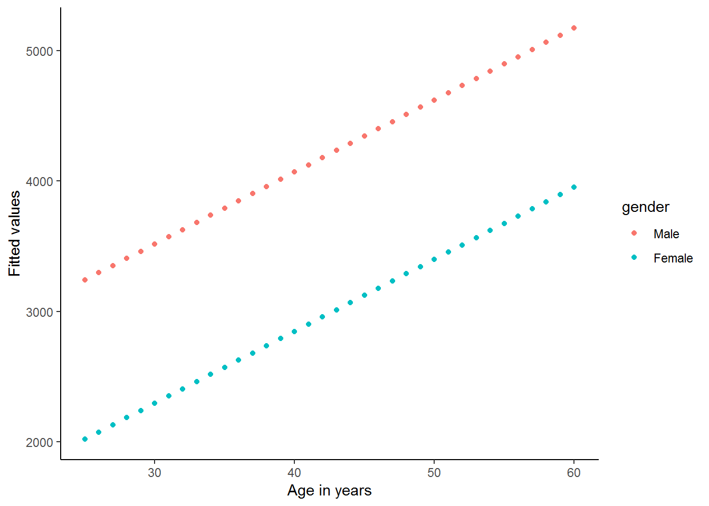
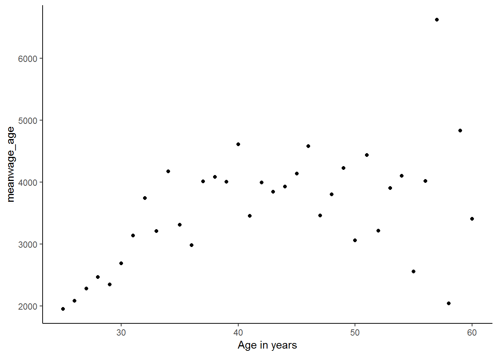
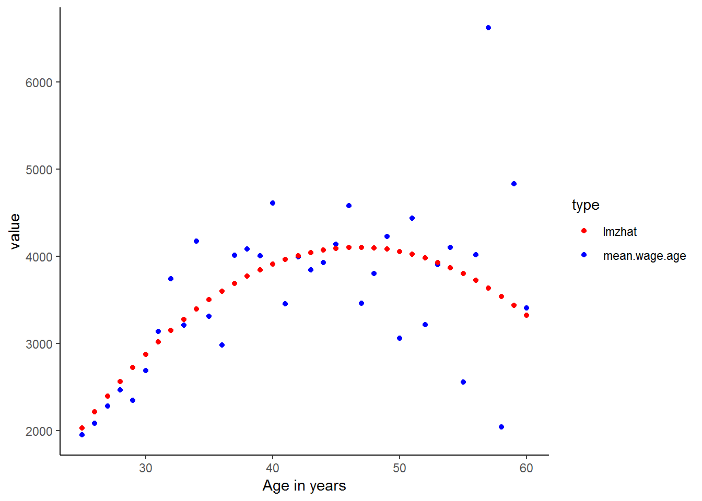

# Multiple regression analysis

## Getting ready

In the previous chapters we generated some variables and ran a few commands that will influence the results that we get in this chapter. If you are starting a new session of R, please copy the following lines of code into an R-script and then run it before you begin the chapter. Make sure that you remember what each line of code is doing.


```r
library(foreign)
library(tidyverse)
```

```
## -- Attaching packages --------
```

```
## v ggplot2 3.0.0     v purrr   0.2.5
## v tibble  1.4.2     v dplyr   0.7.6
## v tidyr   0.8.1     v stringr 1.3.1
## v readr   1.1.1     v forcats 0.3.0
```

```
## -- Conflicts -----------------
## x dplyr::filter() masks stats::filter()
## x dplyr::lag()    masks stats::lag()
```

```r
nids<-read.dta("./data/nids.dta", convert.factors=FALSE)

nids<-nids%>% 
  arrange(hhid, pid)%>%
  group_by(hhid) %>%
  mutate(hhrestrict = 1:n()) %>%
  mutate(hhrestrict = ifelse(hhrestrict==1,1,0))

#Education
nids$educ.new<-nids$w1_best_edu
nids$educ.new[which(nids$w1_best_edu == 25)]<-0
nids$educ.new[which(nids$w1_best_edu <0)]<-NA
nids$educ.new[which(nids$w1_best_edu == 24)]<-NA
nids$educ.new[which(nids$w1_best_edu == 13 | nids$w1_best_edu == 16)]<-10
nids$educ.new[which(nids$w1_best_edu == 14 | nids$w1_best_edu == 17)]<-11
nids$educ.new[which(nids$w1_best_edu == 15)]<-12
nids$educ.new[which(nids$w1_best_edu == 18)]<-13
nids$educ.new[which(nids$w1_best_edu == 18)]<-13
nids$educ.new[which(nids$w1_best_edu == 19)]<-14
nids$educ.new[which(nids$w1_best_edu == 20)]<-15
nids$educ.new[which(nids$w1_best_edu == 21 | nids$w1_best_edu == 22)]<-16
nids$educ.new[which(nids$w1_best_edu == 23)]<-17

#Age
nids$age<-nids$w1_r_best_age_yrs[!is.na(nids$w1_r_best_age_yrs)]

#Rename
nids <- nids%>%
  mutate(race = w1_best_race,
        age = w1_r_best_age_yrs,
        gender = w1_r_b4,
        province = w1_hhprov, 
        hhincome = w1_hhincome) %>% 
  mutate(gender = factor(gender, levels = 1:2, labels = c("Male", "Female")),
         race = factor(race, levels = 1:4, labels = c("African", "Coloured","Asian", "White")),
         province = factor(province, levels=1:9, labels = c("Western Cape","Eastern Cape","Northern Cape","Free State","KwaZulu-Natal","North West","Gauteng","Mpumalanga","Limpopo")),
         w1_hhgeo = factor(w1_hhgeo, levels = 1:4, labels = c("Rural formal", "Tribal authority areas","Urban formal", "Urban informal")))
```

## Introduction

In *Chapter 7*, we learned about simple bivariate regression. Now, it is time to move on to the more complex, but also more exciting multiple regression.

Let’s quickly review what we know about simple regression analysis. In its general form, the simple linear regression model has one independent variable (X) and one dependent variable (Y). In multiple regression, the dependent variable Y is assumed to be a function of a set of K independent variables - $X_1$, $X_2$, $X_3$, …, $X_k$. This yields a new regression equation - an extension of the one in *Chapter 7*:

$Y = a + b_1X_1 + b_2X_2 + ... + b_kX_k$

As with the simple regression equation, the interpretation of each of these coefficients is straight forward. Each "b" is a partial slope coefficient. Put differently, each "b" coefficient is the slope between that particular independent variable X and the dependent variable Y when all other independent variables in the model are equal to zero, or "held constant." For example, the b1 coefficient refers to the slope between X1 and the dependent variable Y when all other variables in the equation, X2, X3, etc., equal zero. Similarly, the value for b2 is the slope for the relationship between X2 and the dependent variable Y, when all other variables, X1, X3, etc., are equal to zero. As in Chapter 7, the "a" refers to the intercept, also known as the constant. This value is the value of predicted Y (i.e. yhat) when all of the independent variables, X1, X2, X3, etc., are equal to zero. Thus, multiple-regression allows us to state relationships between two main variables while controlling for other factors - also known as partial effects.

It should be obvious how useful this approach can be for quantitative social researchers, since we are often interested in social phenomena that go beyond a basic bivariate relationship. As mentioned in the previous chapter, we might be interested in whether the relationship between total monthly household income and total monthly household expenditures vary by rural setting. Or perhaps the relationship is not a matter of household income, but rather of how many household members are present in the home. All of these types of interests require multiple regression. This new approach will allow us to investigate the initial relationship while controlling for a 3rd, a 4th, or even many more factors.

Therefore, for this chapter we will investigate in depth, the relationship between income (`w1_fwag`) and education (`w1_best_edu`). In particular, we are hypothesizing that the amount of income earned by any individual is dependent upon their individual level of education. First, we will need to recode the education variable into linear form. In Chapter 5 we had to recode the original `w1_best_edu` variable into the linear variable `educ_new`. We have therefore including the code in the ‘getting ready’ of this chapter. If you need to go back to review the explanation behind this coding [click][Example: Recoding the Education Variable] here.

We should always check that our recoding worked. So let’s type:


```r
nids%>%
  group_by(educ.new)%>%
  summarise(n=n())
```

```
## # A tibble: 19 x 2
##    educ.new     n
##       <dbl> <int>
##  1        0  6655
##  2        1   883
##  3        2   905
##  4        3  1175
##  5        4  1340
##  6        5  1381
##  7        6  1531
##  8        7  1766
##  9        8  1782
## 10        9  1701
## 11       10  2270
## 12       11  1821
## 13       12  2806
## 14       13   407
## 15       14   582
## 16       15   158
## 17       16   145
## 18       17    67
## 19       NA  3795
```

When running a regression we will often only want to consider a certain subset of observations. For instance in our regression we want to look at returns to education but not everyone in the population is of working age, thus the returns we are interested in only apply to a certain group in the population. In our context we choose to limit our sample to people between the ages of 25 to 60. A lower bound of 25 allows us to assume that individuals have completed their formal education while an upper bound of 60 was slightly below the official retirement age in 2008.

There are a few ways to enforce this restriction in our data. One option would be to subset: `subset= (age >= 25 & age <= 60)` or `[age >= 25 & age <= 60]`, but this of course can be rather tedious! A much more useful way, is to create a dummy variable that marks a subsample from the dataset and then subset on that variable.


```r
nids<-nids %>% 
  mutate(sample1=ifelse(age>=25 & age<=60,1,0))
```

This command creates a dummy variable called sample1 which has a value of one wherever age is between 25 and 60 and a value of 0 otherwise. Thus, to restrict our attention to the subsample of interest we simply have to subset/filter on `sample1==1` (we shall use this third and final option for the remainder of this chapter).

Everything looks good so far. Now, as we have done in the past, we want to do a cursory check of the relationship between our variables using the `cor` command. A check like this also helps us to pick up if we made a mistake in our code. For instance, if we find a negative relationship between education and income (meaning that more education was associated with lower wages), one of the first explanations we might investigate is whether we made a mistake in our coding.

Let’s type:


```r
cor(subset(nids, subset=sample1==1, select=c(w1_fwag, educ.new)), use="complete.obs")
```

```
##            w1_fwag  educ.new
## w1_fwag  1.0000000 0.3953829
## educ.new 0.3953829 1.0000000
```

The correlation between `educ_new` and `w1_fwag` is 0.3954, so education level is moderately associated with income earned. With a correlation, however, we do not know to what extent education makes a difference; we just know that it is positively associated with income. To further understand this relationship, we need to estimate the regression of income on education.

We accomplish this by typing:


```r
lm <- lm(w1_fwag~educ.new, data = nids %>% filter(sample1==1))
summary(lm)
```

```
## 
## Call:
## lm(formula = w1_fwag ~ educ.new, data = nids %>% filter(sample1 == 
##     1))
## 
## Residuals:
##    Min     1Q Median     3Q    Max 
##  -6446  -2399  -1029   1077  84077 
## 
## Coefficients:
##             Estimate Std. Error t value Pr(>|t|)    
## (Intercept) -1241.14     198.00  -6.268 4.06e-10 ***
## educ.new      511.71      19.46  26.290  < 2e-16 ***
## ---
## Signif. codes:  0 '***' 0.001 '**' 0.01 '*' 0.05 '.' 0.1 ' ' 1
## 
## Residual standard error: 5066 on 3730 degrees of freedom
##   (7993 observations deleted due to missingness)
## Multiple R-squared:  0.1563,	Adjusted R-squared:  0.1561 
## F-statistic: 691.1 on 1 and 3730 DF,  p-value: < 2.2e-16
```

$Y = a + bX$

In our case, this equation becomes:

$(predicted w1\_fwag) = -1241.1 +511.7*(educ.new)$

We can immediately interpret the slope coefficient for `educ.new` as the number of Rands (511.7) that average monthly take home pay would increase by for every additional year of education (`educ.new`). Judging from the t-value (26.29), we can tell that the coefficient is significant.

The constant, as discussed before, reflects the value of the dependent variable Y when the independent variables are equal to zero. While this property is technically useful in the calculation of the regression coefficients and calculation of predicted Y values, its actual value is not always of use. Obviously we do not want to ignore it, but we also do not need to dwell on it since it is often not easily interpretable. In our current case, it literally says that when education level is zero, predicted income is -1241.135 Rand. If, however, we had centered our education variable on the sample's mean education, then the "zero" value would actually be the average level of education. Interpreting the constant in that case would be more useful.

Moving along, the R-squared for this regression tells us that education accounts for almost 16% of the variation around the mean of income. Another way to think about it is if we were asked to guess at random the income for an individual in a population sample, our guess would improve by approximately 16% if we knew the education level of the individual instead of just knowing the mean income of the sample.

Let’s now try graphing the regression equation. 


```r
scatter<-data.frame(subset(nids, subset=sample1==1, select=c(educ.new, w1_fwag)))
scatter<-na.omit(scatter)
 
ggplot(scatter, aes(x = educ.new, y = w1_fwag)) + 
  geom_point() + 
  stat_smooth(method = "lm", se = FALSE, colour = "red") +
  xlab("Recoded education") + 
  ylab("Monthly take home pay") +
  theme_classic()
```


Is our regression line a good fit? It is rather hard to tell from the graph above, we have too many data points at each education level to be able to tell how well the line fits these observations! What if we compared our line to the mean wage at each education level? This should give us a better indication of the fit.

First we generate a `meanwage` variable and then we can plot the graph::


```r
scatter$yhat<-lm$fitted.values
scatter%>%
  group_by(educ.new)%>%
  mutate(meanwage=mean(w1_fwag))%>%
  gather(key = type,value=value, -educ.new, -w1_fwag)%>% #reshaping the data using tidyr functions
  ggplot(., aes(educ.new,value, color = type)) +
  geom_point() +
  geom_line() +
  scale_color_manual(values = c("blue","red"))+
  theme_classic()
```


This graph is much easier to evaluate: the blue line is the mean wage across education while the red line plots our fitted/estimated values. The fundamental problem that we see in this graph is that we have fitted a straight line while the relationship between education and wage seems non-linear! We will correct for this non-linear relationship later in this chapter, but for now, we will stick with the assumption that we have a linear relationship between education and wage.

**Issues of Parsimony vs. Saturation**

When thinking about introducing variables into a model, it is important to keep the notions of parsimony and saturation in mind. That is, we should always strive to include only the variables that make sense and that are efficient at capturing the desired social phenomenon. Model building is often a balancing act between parsimony and saturation. When we say that a model is "saturated," we mean that the model has too many variables - it is over specified. Overspecification of a model can have an adverse effect on the results. Therefore, when selecting variables for a model, it is prudent to only include the most necessary variables or risk over specifying the model. With that in mind, let’s proceed.

**Introducing a Third Variable**

At this point, we can consider including our first control variable. It is likely that the amount of income earned by any one person, is not only dependent on their years of education, but also on their age. By including age in our model, we acknowledge that income is also a function of age. It is important to include this factor because most people accumulate not only life experience as they age, but also work experience and skills, thus making them more likely to earn a higher wage.

If you remember our earlier discussion on how to interpret coefficients, each coefficient in a regression model is a partial effect, meaning that the coefficient reflects the effect of a given variable while controlling for the others. In this case it means that when we include `age`, our coefficient for `educ.new` will be the effect of education while controlling for `age`. Let's try running the multiple regression model now:


```r
lm2 <- lm(w1_fwag~age+educ.new, data = nids %>% filter(sample1==1))
summary(lm2)
```

```
## 
## Call:
## lm(formula = w1_fwag ~ age + educ.new, data = nids %>% filter(sample1 == 
##     1))
## 
## Residuals:
##    Min     1Q Median     3Q    Max 
##  -7908  -2304   -968    915  83784 
## 
## Coefficients:
##             Estimate Std. Error t value Pr(>|t|)    
## (Intercept) -6804.60     447.31  -15.21   <2e-16 ***
## age           123.42       8.95   13.79   <2e-16 ***
## educ.new      586.22      19.74   29.69   <2e-16 ***
## ---
## Signif. codes:  0 '***' 0.001 '**' 0.01 '*' 0.05 '.' 0.1 ' ' 1
## 
## Residual standard error: 4943 on 3729 degrees of freedom
##   (7993 observations deleted due to missingness)
## Multiple R-squared:  0.1973,	Adjusted R-squared:  0.1968 
## F-statistic: 458.2 on 2 and 3729 DF,  p-value: < 2.2e-16
```

Compare our old equation (from above):

$(predicted w1\_fwag) = -1241.1 +511.7(educ\_new)$

$\rightarrow {R-squared = 0.1563}$

To our new multiple regression equation:

$(predicted w1\_fwag) = -6804.60 + 586.22*(educ\_new) + 123.4208*(age)$

$\rightarrow {R-squared = 0.1968}$

Right away you should notice the effect that age has on our model. With age included, there is an increase in the coefficient of education (586.22), up from 511.71. Therefore, after controlling for age, on average every additional year of education produces an additional R586.22 per month of income. In addition to this, people tend to earn R123.42 more for every year that they age. Another way of thinking about these new results is that in the initial model, the "true" effect of `educ.new` was being masked by the effect of age.

The addition of a single regressor to the bivariate model probably does not seem that difficult, but as we progress in this chapter, you will realize that this is merely the tip of the iceberg. Now that you have been introduced to multiple regression, try the following two exercises:

**1. It is possible that income as well as the number of household members predict the amount of money a household spends on clothing. Run a regression to see if this hypothesis finds support in our data.**

Question 1 Answer

**2. Among people who reported working, to what extent does the number of hours worked in a week predict a person's monthly income? Without running any further regressions, what other variables might also help predict a person's monthly income?**

Question 2 Answer


## Dummy variables

## Interactions with dummy Variables

Thus far, we have only dealt with the additive effects of dummy variables. That is, the assumption has been that for each independent variable Xi, the amount of change in our dependent variable Y is the same regardless of the values of the other independent variables in the equation. That is to say, if the mean income is higher for males than for females, this is so regardless of race. What if you have a situation where White males earn more than White females, but African women and men tend to earn the same amount? This assumption that there is no interaction between our variables allows us to interpret the partial coefficients as the effect of a variable while controlling for the other independent variables in the model.

The additive assumption, however, does not always hold. As we mentioned above, you may have an interaction between gender and race, where gender differences in income are different for different racial groups. In other words there may be interaction between the categorical variables `gender` and `w1_best_race`. More generally, when results indicate a statistically significant interaction effect between gender and race, the data suggests that being an “African Female” or a “White Male”, or any other combination of race and gender, is qualitatively different from being in both race and gender categories independently.

We can illustrate what we mean by the additive effect of dummy variables in regression with the graphs below. Let’s assume we have a regression consisting of three variables: income is the dependent variable (Y) and age (X1) and gender(X2) are the dependent variables. Now, the two lines in the graph below give the relationship between income and age for men (top line) and women (bottom line). That is, because men on average earn more than women we would expect to find predicted regression lines like the ones below. However, notice that these lines are parallel with slope b1 (coefficient of age) and that we assumed in the regression that holding age constant men earn b2 Rand more than women.


This graph is not merely theoretical. We can easily reproduce it using our data:


```r
dum<-nids %>% 
  filter(sample1==1) %>% 
  select(hhid, pid, hhrestrict, w1_best_race, age, educ.new, w1_fwag, w1_r_b4, gender, race) %>% 
  na.omit()

lmx <- lm(w1_fwag~age+gender, data = dum)
summary(lmx)
```

```
## 
## Call:
## lm(formula = w1_fwag ~ age + gender, data = dum)
## 
## Residuals:
##    Min     1Q Median     3Q    Max 
##  -4812  -2454  -1517    373  85986 
## 
## Coefficients:
##              Estimate Std. Error t value Pr(>|t|)    
## (Intercept)   1858.95     390.89   4.756 2.05e-06 ***
## age             55.26       9.55   5.786 7.79e-09 ***
## genderFemale -1222.89     180.21  -6.786 1.34e-11 ***
## ---
## Signif. codes:  0 '***' 0.001 '**' 0.01 '*' 0.05 '.' 0.1 ' ' 1
## 
## Residual standard error: 5465 on 3725 degrees of freedom
## Multiple R-squared:  0.01963,	Adjusted R-squared:  0.01911 
## F-statistic:  37.3 on 2 and 3725 DF,  p-value: < 2.2e-16
```

```r
dum$prediction<-lmx$fitted.values

ggplot(dum, aes(x = age, y = prediction, color=gender))+
geom_point() + 
xlab("Age in years") + 
  ylab("Fitted values") +
  theme_classic()
```



It is important to realize that these two lines are parallel by construction. No matter what data we have, these lines are forced to be parallel by the way in which we include gender and age separately in our regression. At the risk of sounding repetitive, we force the difference in income between men and women to be exactly the same, after we have controlled for the other variables included in the regression (here only age). If we want to allow for this relationship to vary, we must use interaction terms.

In the second graph below, we find a hypothetical interaction effect between age and gender. That is, the effect of age (slope of the line) on income depends on the gender of the individual.
In this case, we find that the upper-most line on the graph has a steeper slope than the line below it, thus the effect of gender depends on the value of Xi -- in this case, the gender of the individual. This is saying that we might have a situation where young men and women tend to earn similar amounts, but as people get older men’s income tend to increase by a greater amount every year than women’s income.


The above graph is simply a hypothetical example. Do you think that this relationship will be reflected in the data? Let’s see:


```r
lmz <- lm(w1_fwag~age*gender, data = dum)
summary(lmz)
```

```
## 
## Call:
## lm(formula = w1_fwag ~ age * gender, data = dum)
## 
## Residuals:
##    Min     1Q Median     3Q    Max 
##  -5479  -2303  -1548    351  85983 
## 
## Coefficients:
##                  Estimate Std. Error t value Pr(>|t|)    
## (Intercept)        565.20     511.62   1.105   0.2693    
## age                 88.50      12.77   6.928 5.00e-12 ***
## genderFemale      1749.25     781.31   2.239   0.0252 *  
## age:genderFemale   -75.00      19.19  -3.909 9.43e-05 ***
## ---
## Signif. codes:  0 '***' 0.001 '**' 0.01 '*' 0.05 '.' 0.1 ' ' 1
## 
## Residual standard error: 5454 on 3724 degrees of freedom
## Multiple R-squared:  0.02364,	Adjusted R-squared:  0.02285 
## F-statistic: 30.06 on 3 and 3724 DF,  p-value: < 2.2e-16
```

```r
dum$prediction<-lmz$fitted.values

ggplot(dum, aes(x = age, y = prediction, color=gender)) +
  geom_point() + 
  xlab("Age in years") + 
  ylab("Fitted values") +
  theme_classic()
```


It appears as if there is a strong interaction between age and gender in this simple regression. The regression output and graph suggest that men and women start with a similar income level
at a young age (25), but thereafter the average man’s income increases by R87 every year, while the average woman’s income increases by only R88.5-R75=R13.5 per year.

Let’s return to our slightly more complete model and see whether we can use interaction between variables to improve our model. It is important however to always remember that just
as you should not arbitrarily include new variables in your model without a theoretical justification; similarly you should never arbitrarily interact two variables without a good reason for doing so.

In practice, creating an interaction term in R between two categorical variables is as easy as inserting an asterisk $"*"$ between the two variables you wish to interact. Understanding fully what you are doing is a little trickier. For instance, we might wish to interact gender (2 categories) with race (4 categories). 


```r
lm5 <- lm(w1_fwag~educ.new+age+relevel(race, "White")*gender, data = dum)
```

Using `stargazer` package [@R-stargazer]


```r
library(stargazer)
#summary(lm5)
stargazer(lm5, type = "text")
```

```
## 
## =======================================================================
##                                                 Dependent variable:    
##                                             ---------------------------
##                                                       w1_fwag          
## -----------------------------------------------------------------------
## educ.new                                            461.210***         
##                                                      (19.498)          
##                                                                        
## age                                                  99.577***         
##                                                       (8.452)          
##                                                                        
## relevel(race, "White")African                      -7,536.520***       
##                                                      (366.344)         
##                                                                        
## relevel(race, "White")Coloured                     -7,584.998***       
##                                                      (407.904)         
##                                                                        
## relevel(race, "White")Asian                        -3,416.403***       
##                                                      (778.996)         
##                                                                        
## genderFemale                                       -5,522.407***       
##                                                      (474.680)         
##                                                                        
## relevel(race, "White")African:genderFemale         4,266.182***        
##                                                      (509.259)         
##                                                                        
## relevel(race, "White")Coloured:genderFemale        4,486.902***        
##                                                      (572.918)         
##                                                                        
## relevel(race, "White")Asian:genderFemale           4,646.987***        
##                                                     (1,180.159)        
##                                                                        
## Constant                                           2,763.515***        
##                                                      (591.960)         
##                                                                        
## -----------------------------------------------------------------------
## Observations                                           3,728           
## R2                                                     0.318           
## Adjusted R2                                            0.316           
## Residual Std. Error                            4,562.474 (df = 3718)   
## F Statistic                                  192.537*** (df = 9; 3718) 
## =======================================================================
## Note:                                       *p<0.1; **p<0.05; ***p<0.01
```

When interpreting regressions with interaction effects, we need to be careful to not just interpret the partial effects and ignore the interaction terms. The partial coefficients no longer “stand alone” and the interaction terms need to be incorporated into our explanations. For instance, we can say that White women earn R5522 less than White men, on average holding education and age constant, since White is the reference racial group. But if we compare African men to African women, we can say that African women earn R5522 - R4266 = R1256 less than African men. This gender difference in earnings is **much smaller** for Africans than for Whites. Previously, we were forcing it to be equal across racial categories. This is why it is so important to include these interactions in our regression!

Provided we update our formula, we still calculate any estimated yhat value as normal. For example, if we were interested in calculating the income for an African female aged 35 with a 12 year level of education, we compute the following:

$predicted income = 2763.515 + 461.2096(12) + 99.57732(35) - 7536.52(1) -5 522.407(1)+4266.182(1)$

$predicted income = 1731.95$

**5. In figuring out what predicts someone's net pay, is there an interaction effect between education and gender? Compute a regression where education, age, gender and race are the independent variables explaining someone's net pay. (Restrict your analysis to sample1).**

Question 5 Answer


## Linear transformations of non-linear relationships

Thus far, we have assumed linear relationships for all of our regression models. In fact, a linear relationship is a basic requirement for regression analysis. Empirically, however, variables are often not associated in a linear fashion. Yet this reality hardly precludes regression analyses from accurately predicting and describing real world phenomenon. In this section we will show you two basic approaches to dealing with non-linear relationships. The first method will be to include a quadratic term; and the second will use natural logarithms to improve our model. It will often be the case that we can use the natural logarithm of a term to transform a non-linear relationship into an approximately linear one and vastly improve the fit of a regression line. Note: Logarithmic and Quadratic transformations are not restricted to multiple regression, however, we have placed them in the multiple regression chapter because they are rather advanced topics and should only be addressed after one has a clear understanding of all of the material in chapters 7 and 8 prior to this section.

**Transformations Using the Natural Logarithm**

Often it is desirable to run a regression using the natural logarithm (a log to the base of the mathematical constant e) of a variable instead of the variable itself. The advantages of using logarithms include the following:
1.	Firstly, logarithms transform a variable in such a way that the logged variable contains exactly the same information as the original variable but the influence of outliers is greatly diminished. This can sometimes drastically affect the slope of the regression line because the natural logarithm of a variable compresses the data and is much less sensitive to extreme observations than is the variable itself.
2.	Secondly, taking logarithms of a variable allows us to interpret the relevant coefficients in our regression as percentage changes.
3.	Thirdly, taking the logarithm of a variable can often make the distribution closer to a ‘normal’ distribution.
4.	And lastly, if the relationship between a dependent variable and the independent variable is non-linear, making one or both of the variables logarithmic can sometimes produce a linear relationship. Therefore, although a linear relationship might not exist between two variables, a linear relationship might exist between the natural logarithms of the two variables.

At the beginning of this chapter we hinted that the relationship between wage and education in our regression was non-linear. Let us examine the relationship between these two variables in more depth. If we type:


```r
nids%>%
  group_by(educ.new)%>%
  summarise(Mean = mean(w1_fwag, na.rm=TRUE), sd=sd(w1_fwag, na.rm=TRUE))
```

```
## # A tibble: 19 x 3
##    educ.new   Mean     sd
##       <dbl>  <dbl>  <dbl>
##  1        0  1162.  1053.
##  2        1  1292.  1032.
##  3        2   992.   767.
##  4        3  1282.  1222.
##  5        4  1668.  3272.
##  6        5  1228.  1003.
##  7        6  1329.   988.
##  8        7  1584.  2645.
##  9        8  1698.  1668.
## 10        9  1528.  1285.
## 11       10  2396.  2438.
## 12       11  2114.  2302.
## 13       12  3862.  5485.
## 14       13  4572.  4275.
## 15       14  7417.  7834.
## 16       15  8414.  5942.
## 17       16 11163.  9193.
## 18       17 22572. 17303.
## 19       NA  1774.  2979.
```

The above data implies reveals that the returns to education are non-linear. In fact, earnings are fairly flat in early grades, but we see big increases from 9 to 10, 12 to 13 and for every additional year of tertiary education. Below we also reproduce the graph we generated in the beginning of this chapter, which corroborates our conclusions above.


As you have probably guessed by now, we can most likely improve the fit of our model by logging one or both of the variables. The distribution of the wage variable has been well researched and it has become common-practice to use a log transformation to make it ‘behave better’. Apart from the non-linear relationship between wage and education, we can see the benefit of logging the wage variable from the two graphs below. The first shows a density plot of the wage variable and the second shows a density plot of the transformed log-wage variable.


```r
kernel<-nids %>% 
  filter(sample1==1) %>% 
  select(hhid, w1_fwag, educ.new, sample1, age, race, gender) %>% 
  na.omit()

library(scales)
```

```
## 
## Attaching package: 'scales'
```

```
## The following object is masked from 'package:purrr':
## 
##     discard
```

```
## The following object is masked from 'package:readr':
## 
##     col_factor
```

```r
ggplot(kernel, aes(x = w1_fwag)) +
  geom_density() +
  scale_y_continuous(breaks=seq(0,0.0003,0.0001), labels = comma) +
  scale_x_continuous(breaks=seq(0,100000,20000), labels = comma) +
  labs(x="Monthly take home pay from main job including BRACKETS") +
  theme_classic()
```


```r
kernel$lnwage<-log(kernel$w1_fwag)
ggplot(kernel, aes(x = lnwage)) +
  geom_density() +
  theme_classic()
```


From these two graphs, it is immediately clear that the second has a far more ‘normal’ distribution and that since all the values are squashed closer together, outliers are unlikely to exert as great an influence on our regression. These two reasons, in addition to the nonlinear relationship between wage and education, as well as the precedent set in the literature, provide ample rationale for taking the log of our wage variable.

Thus we are now going to investigate what happens if we include the logged wage variable in our simple linear regression with education as our independent variable:


```r
lmy <- lm(lnwage~educ.new, data = subset(kernel, subset=sample1 ==1))
summary(lmy)
```

```
## 
## Call:
## lm(formula = lnwage ~ educ.new, data = subset(kernel, subset = sample1 == 
##     1))
## 
## Residuals:
##     Min      1Q  Median      3Q     Max 
## -4.2731 -0.5126 -0.0075  0.5421  3.4487 
## 
## Coefficients:
##             Estimate Std. Error t value Pr(>|t|)    
## (Intercept) 6.315605   0.033577  188.10   <2e-16 ***
## educ.new    0.136170   0.003301   41.25   <2e-16 ***
## ---
## Signif. codes:  0 '***' 0.001 '**' 0.01 '*' 0.05 '.' 0.1 ' ' 1
## 
## Residual standard error: 0.8588 on 3726 degrees of freedom
## Multiple R-squared:  0.3135,	Adjusted R-squared:  0.3134 
## F-statistic:  1702 on 1 and 3726 DF,  p-value: < 2.2e-16
```

The R-squared value suggests that we have a much better fitting regression line when compared to a regression of `w1_fwag` on `educ_new` (see the first regression run in this chapter). In fact, a simple log transformation of the wage variable has increased the predictive power of our model from 15.63 to 31.34%! Let’s generate a new graph for this regression:


```r
kernel$lnwage<-log(kernel$w1_fwag)

lmy <- lm(lnwage~educ.new, data = subset(kernel, subset=sample1==1))
summary(lmy)
```

```
## 
## Call:
## lm(formula = lnwage ~ educ.new, data = subset(kernel, subset = sample1 == 
##     1))
## 
## Residuals:
##     Min      1Q  Median      3Q     Max 
## -4.2731 -0.5126 -0.0075  0.5421  3.4487 
## 
## Coefficients:
##             Estimate Std. Error t value Pr(>|t|)    
## (Intercept) 6.315605   0.033577  188.10   <2e-16 ***
## educ.new    0.136170   0.003301   41.25   <2e-16 ***
## ---
## Signif. codes:  0 '***' 0.001 '**' 0.01 '*' 0.05 '.' 0.1 ' ' 1
## 
## Residual standard error: 0.8588 on 3726 degrees of freedom
## Multiple R-squared:  0.3135,	Adjusted R-squared:  0.3134 
## F-statistic:  1702 on 1 and 3726 DF,  p-value: < 2.2e-16
```

```r
kernel$lmyhat<-lmy$fitted.values   #other predict options

kernel%>%
  filter(sample1==1)%>%
  group_by(educ.new)%>%
  mutate(meanlnwage=mean(lnwage), lmyhat=lmyhat)%>%
  select(educ.new, lmyhat, meanlnwage)%>%
  gather(key = type,value=value, -educ.new)%>%
  ggplot(., aes(educ.new,value, color = type)) +
  geom_point() +
  geom_line() +
  scale_color_manual(values=c("red","blue")) +
  xlab("Recoded education") +
  theme_classic()
```


Transforming the wage variable has helped to linearise the data (the blue line) and so our linear model (red line) can produce a better fit!

Now we regress `lnwage` on `educ_new` as well as our set of control variables.


```r
lmy <- lm(lnwage~educ.new+age+relevel(race, "White")*gender, data = subset(kernel, subset=sample1==1))
#summary(lmy)
stargazer(lmy, type="text")
```

```
## 
## =======================================================================
##                                                 Dependent variable:    
##                                             ---------------------------
##                                                       lnwage           
## -----------------------------------------------------------------------
## educ.new                                             0.133***          
##                                                       (0.003)          
##                                                                        
## age                                                  0.022***          
##                                                       (0.001)          
##                                                                        
## relevel(race, "White")African                        -0.909***         
##                                                       (0.061)          
##                                                                        
## relevel(race, "White")Coloured                       -0.905***         
##                                                       (0.067)          
##                                                                        
## relevel(race, "White")Asian                           -0.164           
##                                                       (0.129)          
##                                                                        
## genderFemale                                         -0.462***         
##                                                       (0.079)          
##                                                                        
## relevel(race, "White")African:genderFemale             0.025           
##                                                       (0.084)          
##                                                                        
## relevel(race, "White")Coloured:genderFemale            0.084           
##                                                       (0.095)          
##                                                                        
## relevel(race, "White")Asian:genderFemale               0.236           
##                                                       (0.195)          
##                                                                        
## Constant                                             6.474***          
##                                                       (0.098)          
##                                                                        
## -----------------------------------------------------------------------
## Observations                                           3,728           
## R2                                                     0.471           
## Adjusted R2                                            0.469           
## Residual Std. Error                              0.755 (df = 3718)     
## F Statistic                                  367.382*** (df = 9; 3718) 
## =======================================================================
## Note:                                       *p<0.1; **p<0.05; ***p<0.01
```

The Adjusted R-squared value is 0.4694, thus logging the wage variable appears to be advantageous. We need to be careful when we interpret the coefficients in this regression since our dependant variable is now in a different form. The coefficients should, in fact, be interpreted as rates of return. For example, the rate of return to education is 0.1326 - that is, an extra year of education will, on average and controlling for other variables, increase average wages by 13.26%.

**Transformations using Squared Terms**

You may remember that we previously noted that it may not make sense that as we get older we continue to earn more money. Researchers often include both age and age2 in regression models because it allows the effect of one-year increase in age to change as a person gets older. By including age squared, we are controlling for the idea that there comes a point in time after which age no longer provides an advantage in the workforce. That is, the effect of age is not likely to remain the same as we get older; after all, a 90 year old employee is likely to earn less, rather than more, than say a 60 year old. Therefore, by including age2, we allow for age to have a parabolic effect on income (think back to the simple parabolas you used to draw in school - first up and then down). We can see this relationship by plotting mean wage levels for every age group against age:


```r
kernel%>%
  group_by(age)%>%
  summarise(mean.wage.age=mean(w1_fwag, na.rm=TRUE))%>%
  ggplot(., aes(x = age, y = mean.wage.age)) + 
  geom_point() + 
  xlab("Age in years") + 
  ylab("meanwage_age") +
  theme_classic()
```



It is clear from this graph that the relationship between mean wages at every age and age is parabolic. So, let’s create a new age-squared variable in order to try to improve the fit of our regression.


```r
kernel<-kernel%>%
  mutate(age2 = age*age)
  
lmy <- lm(lnwage~educ.new+age+age2+relevel(race, "White")+gender, data = kernel)
#summary(lmy)
stargazer(lmy, type="text")
```

```
## 
## ==========================================================
##                                    Dependent variable:    
##                                ---------------------------
##                                          lnwage           
## ----------------------------------------------------------
## educ.new                                0.132***          
##                                          (0.003)          
##                                                           
## age                                     0.075***          
##                                          (0.012)          
##                                                           
## age2                                    -0.001***         
##                                         (0.0001)          
##                                                           
## relevel(race, "White")African           -0.899***         
##                                          (0.045)          
##                                                           
## relevel(race, "White")Coloured          -0.872***         
##                                          (0.050)          
##                                                           
## relevel(race, "White")Asian              -0.077           
##                                          (0.097)          
##                                                           
## genderFemale                            -0.426***         
##                                          (0.025)          
##                                                           
## Constant                                5.441***          
##                                          (0.236)          
##                                                           
## ----------------------------------------------------------
## Observations                              3,728           
## R2                                        0.473           
## Adjusted R2                               0.472           
## Residual Std. Error                 0.753 (df = 3720)     
## F Statistic                     477.787*** (df = 7; 3720) 
## ==========================================================
## Note:                          *p<0.1; **p<0.05; ***p<0.01
```


Let’s interpret our coefficients. We find that each year of education increases income by 13.18% on average. Looking at age, we see that coefficient on `age` is positive, but the coefficient on `age2` is negative. If you think back to the quadratic formula ($ax^2 + bx + c$), this means that **a** is negative and **b** is positive. This suggests a parabolic influence of `age` on `lnwage` with a maximum at the turning point $\frac{-b}{2a}$. In other words, every additional year of age increases wages up to the age of 58 and thereafter every additional year decreases wages. We calculate this turning point using the turning point formula ($\frac{-b}{2a}$), which for our `age` and `age2` coefficients is: 
 
$\frac{-0.0751816}{2*(-0.0006515)}$

We can also get a graphical idea of what is going on if we look at a simple regression of wage on age:


```r
lmz <- lm(w1_fwag~age, data = kernel)
kernel$lmzhat<-lmz$fitted.values

kernel%>%
  group_by(age)%>%
  mutate(mean.wage.age=mean(w1_fwag, na.rm=TRUE))%>%
  select(age, mean.wage.age, lmzhat)%>%
  gather(key = type,value=value, -age)%>%
  ggplot(., aes(age,value, color = type)) +
  geom_point() + 
  scale_color_manual(values=c("red","blue")) +
  xlab("Age in years") +
  theme_classic()
```


As expected the linear predicted values are poor estimates for the actual income values. Let’s see whether included the age-squared variable in the regression improves the fit of the predicted values.


```r
kernel<-kernel%>%
  mutate(age2 = age*age)

lmz <- lm(w1_fwag~age + age2, data = kernel)
kernel$lmzhat<-lmz$fitted.values

kernel%>%
  group_by(age)%>%
  mutate(mean.wage.age=mean(w1_fwag, na.rm=TRUE))%>%
  select(age, mean.wage.age, lmzhat)%>%
  gather(key = type,value=value, -age)%>%
  ggplot(., aes(age,value, color = type)) +
  geom_point() +
  scale_color_manual(values=c("red","blue")) +
  xlab("Age in years") +
  theme_classic()
```



Much better! Also, you may have found that many of the ideas learnt in these chapters simpler to understand when they were expressed as graphs. There is a lesson here. As they say, a picture says a thousand words. Even though you are now starting to become more familiar with more complicated statistical analysis, such as multiple regression, you should never overlook the power of simple descriptive statistics and graphical representations of the data. In fact, it is a common mistake that people jump into complicated statistical analysis without getting properly acquainted with their data. This can lead to rubbish results which could have been easily avoided.

Nevertheless, since you have now completed this course, we are sure that you are well on your way to doing some fantastic statistical research and will be able to avoid many of the potential pitfalls! But before you do, quickly try the exercises to make sure you are comfortable with these new methods and to explore some slightly more complicated ideas. Good luck!

## Question Answers

## Exercises

**1.	What effect does being Indian/Asian have on household size, in comparison to being Coloured?**

Exercise 1 Answer

**2.	Regress household expenditure on household income and number of rooms in the house. What exactly are the F and t statistics testing in this regression? (Difficult)**

Exercise 2 Answer

**3.	Households speaking which language have the lowest total monthly expenditure (controlling for total monthly income)? What about the lowest?**

Exercise 3 Answer

**4.	Graph total monthly nonfood expenditure on total monthly household income. Now logarithmically transform both variables and graph them. Which do you think will produce a stronger regression model? Now run the regression with the original variables and the log transformed ones. Were you right? Why or why not?**

Exercise 4 Answer


## Exercise answers


## Session information


```r
print(sessionInfo(), locale = FALSE)
```

```
## R version 3.5.1 (2018-07-02)
## Platform: x86_64-w64-mingw32/x64 (64-bit)
## Running under: Windows 7 x64 (build 7601) Service Pack 1
## 
## Matrix products: default
## 
## attached base packages:
## [1] stats     graphics  grDevices utils     datasets  methods   base     
## 
## other attached packages:
##  [1] scales_0.5.0    stargazer_5.2.2 bindrcpp_0.2.2  forcats_0.3.0  
##  [5] stringr_1.3.1   dplyr_0.7.6     purrr_0.2.5     readr_1.1.1    
##  [9] tidyr_0.8.1     tibble_1.4.2    ggplot2_3.0.0   tidyverse_1.2.1
## [13] foreign_0.8-70 
## 
## loaded via a namespace (and not attached):
##  [1] tidyselect_0.2.4 xfun_0.2         reshape2_1.4.3   haven_1.1.2     
##  [5] lattice_0.20-35  colorspace_1.3-2 htmltools_0.3.6  yaml_2.1.19     
##  [9] utf8_1.1.4       rlang_0.2.1      pillar_1.2.3     withr_2.1.2     
## [13] glue_1.2.0       modelr_0.1.2     readxl_1.1.0     bindr_0.1.1     
## [17] plyr_1.8.4       munsell_0.5.0    gtable_0.2.0     cellranger_1.1.0
## [21] rvest_0.3.2      psych_1.8.4      evaluate_0.10.1  labeling_0.3    
## [25] knitr_1.20       parallel_3.5.1   broom_0.4.5      Rcpp_0.12.17    
## [29] backports_1.1.2  jsonlite_1.5     mnormt_1.5-5     hms_0.4.2       
## [33] digest_0.6.15    stringi_1.1.7    bookdown_0.7     grid_3.5.1      
## [37] rprojroot_1.3-2  cli_1.0.0        tools_3.5.1      magrittr_1.5    
## [41] lazyeval_0.2.1   crayon_1.3.4     pkgconfig_2.0.1  xml2_1.2.0      
## [45] lubridate_1.7.4  assertthat_0.2.0 rmarkdown_1.10   httr_1.3.1      
## [49] rstudioapi_0.7   R6_2.2.2         nlme_3.1-137     compiler_3.5.1
```

