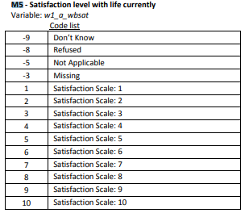
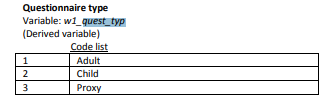

# Understanding distributions

## Introduction

Now that we have acquired some basic R skills, we are ready to begin analysing the data. The immediate problem is -- Where do we begin? As we have seen, there are an enormous number of variables and observations at our disposal although none of this information in its raw form is especially useful. How can we summarize this massive amount of information simply and quickly to make it more accessible?

From Chapter 2, we now know how to open a data file and examine the file's contents in R. It turns out that we have more information than we can usefully process. To see this, import the data set (`nids.dta`) and open an output file (`chapter3.txt`). Now, simply type:


```r
library(tidyverse)
```

```
## -- Attaching packages ----------------------- tidyverse 1.2.1 --
```

```
## v ggplot2 3.0.0     v purrr   0.2.5
## v tibble  1.4.2     v dplyr   0.7.6
## v tidyr   0.8.1     v stringr 1.3.1
## v readr   1.1.1     v forcats 0.3.0
```

```
## -- Conflicts -------------------------- tidyverse_conflicts() --
## x dplyr::filter() masks stats::filter()
## x dplyr::lag()    masks stats::lag()
```

```r
library(foreign)

nids<-read.dta("./data/nids.dta", convert.factors=FALSE)

#sink(file="./sink/chapter3.txt")
#table(nids$w1_hhincome)
#sink()
```

A large number of households scroll by. After seeing these numbers fly by, do you now know more about the distribution of income in South Africa? Probably not. We need a handy way to summarize lots of quantitative raw data, and R is very helpful here. For example, while we could, in principle, simply count the thousands of observations as they scroll by, R commands essentially do this in a much more efficient and sophisticated fashion. We will start by learning how to answer the following questions:

1.	How many Africans are in the data?
2.	What percentage of the sample is made up of Coloured respondents?
3.	How many White men in the sample reside in rural areas?
4.	Are there more men or women over the age of 60?
5.	What percentage of the NIDS sample is made up of sons and daughters?

Using R, these questions are quickly and easily answered. First, though, we need to learn about different types of variables.


## Variable types

In the NIDS dataset, there are several types of variables. If we load/import `nids.dta` into R and type `names(nids)`, we will see the list of variables names in the Console window. Economists, sociologists, and psychologists use different language to describe the multiple types of variables. Here, we will divide variables into two types: *continuous* variables and *categorical* variables. However, each of these types of variables can be applied to either the *individual* or the entire *household*. In this regard, we must understand the difference between an *individual-level variable* and a *household-level variable* as well. The statistical and graphical tools used to understand the distributions of the various types of variables are quite different, so it is important to understand the differences between these measures. We will now elaborate on what we mean by continuous versus categorical variables and then move on to explaining how these can be applied on an individual or household level.

**Categorical Variables:** Categorical variables, also known as nominal variables are made up of separate and distinct categories which do not have an inherent order. To code these variables, each category is typically assigned a value, but this assignment is arbitrary. Take for example the race variable, `w1_best_race`. Each racial group is assigned an arbitrary value. As we saw in chapter 2, in our data set if a person is African, the race variable for that person is set to 1. If the person is Coloured, the value is set to 2, Indian/Asian is 3, and White is 4. For the gender variable `w1_r_b4`, males are coded as 1 and females as 2. Other examples of what we will consider categorical variables include the household id number (`hhid`) the relationship to the head of household (`w1_r_b3`), and province (`w1_hhprov`).

A special type of a categorical variable is a dummy variable. A dummy variable is a variable that typically takes on a value of one if the observation meets specified criteria and a value of zero if otherwise. We will often want to create dummy variables ourselves. For example, if we wanted to create a dummy variable for whether a household was White, we could use the following `dplyr` commands.


```r
nids<-nids %>%
  mutate(white = ifelse(w1_best_race==4,1,0))
```

**Continuous Variables:** Continuous variables have an infinite number of possible values that fall between any two observed values. For example, consider age. In our data, age is recorded in years. But it could have been recorded in months, days, minutes, or even seconds. A continuous variable is ordinal in the sense that its values have an inherent order. In the age example, an age of 16 years is one year older than the age of 15 years, thus the unit of measurement in between these two values is itself meaningful. (This may seem like common sense, but when we consider categorical variables, this will no longer be true.). Examples of continuous variables in the NIDS data set include age (`w1_r_best_age_yrs`), household monthly income (`w1_hhincome`), and the household expenditure measure (`w1_h_expenditure`) to name but a few.

We are actually not being terribly careful with our definitions. Consider, for example, a variable that counts members of the household (`w1_hhsizer`). Household size might be 5 or 6, but it will never be 5.49. Nonetheless, if we were told that the average number of members of a household was 5.49, this would be comprehendible. We would know that, on average, there are more than 5 members and less than 6. We are going to treat variables like household size and number of births as continuous variables. (Some disciplines refer to these as discrete variables.) Taking the average gives an answer that is readily interpreted. Taking the average of a categorical variable, on the other hand, yields nonsense (e.g. it doesn’t make any sense to talk about the average race in the economy).

In general, it is important to know the types of variables you are using because some of the tools used to analyze variables differ depending on whether the variable is continuous or categorical. Another point to keep in mind is whether the variable you are using is an **individual level** or **household-level variable.**

**Individual-level Variables:** Individual-level variables are made up of values that are unique to each person in the household. An example is the variable for age (`w1_r_best_age_yrs`). To see an example of an individual-level variable, type the following:


```r
nids %>%
  select(hhid, w1_r_best_age_yrs)%>%
  arrange(hhid) %>%
  head(10)
```

```
##      hhid w1_r_best_age_yrs
## 1  101012                51
## 2  101013                45
## 3  101013                32
## 4  101013                 9
## 5  101013                13
## 6  101013                11
## 7  101014                15
## 8  101014                25
## 9  101014                60
## 10 101014                22
```

As we can see, each person in the same household has an age value that is unique to them. Other examples in the NIDS data set would include the following variables: `w1_best_edu` (educational attainment level), and `w1_r_b4` (gender).

**Household-level Variables:** Household-level variables have the same value for every person in the household. An example would be the variable for total monthly household income (`w1_hhincome`). To see an example of a household-level variable, type the following commands:


```r
nids %>%
  select(hhid, w1_hhincome)%>%
  arrange(hhid) %>%
  head(10)
```

```
##      hhid w1_hhincome
## 1  101012   1044.7892
## 2  101013    588.3008
## 3  101013    588.3008
## 4  101013    588.3008
## 5  101013    588.3008
## 6  101013    588.3008
## 7  101014   1307.4182
## 8  101014   1307.4182
## 9  101014   1307.4182
## 10 101014   1307.4182
```


As we can see, each person in the same household has the same value of total household monthly income. Other examples in the NIDS data set include the following variables: `w1_h_expf` (total household monthly food expenditure) and `w1_hhgovt` (total income from government grants)


## Count observations - dim(),nrow()

So far we have introduced `dim()` which return the dimensions of a data frame, i.e. number of rows and columns, e.g.


```r
dim(nids)
```

```
## [1] 31170  2090
```

There are other base R functions to achieve the same objective. These are `nrow` and `ncol` to return the number of rows and columns respectifully. For example, type:


```r
nrow(nids)
```

```
## [1] 31170
```

The results should show that there are 31170 observations in this data set. However, try an
example using a qualifier. 


`dplyr` has a function that tallies observations as well.Suppose we want to count number of observations that satisfy a specific condition, for instance, suppose we want to count the number of females (`w1_r_b4==2`) in the data set:


```r
nids %>% 
  filter(w1_r_b4==2) %>% #filter females
  count
```

```
## # A tibble: 1 x 1
##       n
##   <int>
## 1 16527
```

The results should show that there are 16527, females in the data set.

## Using household level variables

We have seen above that household level variables have the same value for each member in the household. But it will often be the case where we want to count only one of these values per household. Suppose, for instance, that we wanted to count the number of households in the data set. In order to accomplish this task, we need to create a new variable which we will call `hhrestrict`.


```r
nids<-nids%>% #assign the nids object to nids
  arrange(hhid, pid)%>% #sort by hhid then pid
  group_by(hhid) %>% #group by hhid
  mutate(hhrestrict = 1:n()) %>% # create hhrestrict that is numbered individuals within the group by variable
  mutate(hhrestrict = ifelse(hhrestrict==1,1,0)) #make hhrestrict 1 for only the first observation
```

Lets try to understand what this variable looks like. So type the following commands to view the first 20 observations:


```r
nids %>%
  select(hhid, hhrestrict) %>%
  head(20)
```

```
## # A tibble: 20 x 2
## # Groups:   hhid [7]
##      hhid hhrestrict
##     <int>      <dbl>
##  1 101012          1
##  2 101013          1
##  3 101013          0
##  4 101013          0
##  5 101013          0
##  6 101013          0
##  7 101014          1
##  8 101014          0
##  9 101014          0
## 10 101014          0
## 11 101014          0
## 12 101014          0
## 13 101015          1
## 14 101015          0
## 15 101016          1
## 16 101016          0
## 17 101017          1
## 18 101017          0
## 19 101017          0
## 20 101018          1
```

Alternatively


```r
head(nids[,c("hhid", "hhrestrict")], n = 20L)
```

```
## # A tibble: 20 x 2
## # Groups:   hhid [7]
##      hhid hhrestrict
##     <int>      <dbl>
##  1 101012          1
##  2 101013          1
##  3 101013          0
##  4 101013          0
##  5 101013          0
##  6 101013          0
##  7 101014          1
##  8 101014          0
##  9 101014          0
## 10 101014          0
## 11 101014          0
## 12 101014          0
## 13 101015          1
## 14 101015          0
## 15 101016          1
## 16 101016          0
## 17 101017          1
## 18 101017          0
## 19 101017          0
## 20 101018          1
```


The hhrestrict variable is a dummy variable where a one is given to the first member of the household and a 0 for any consequent members. Using this variable we can count the number of households in the data set:


```r
nids%>%
  filter(hhrestrict==1)%>%
  nrow
```

```
## [1] 7305
```

The 7305 that R gives us is the number of households in the data set.

We will be using the `hhrestrict` variable extensively in future chapters, so let’s try one more example. Suppose we wanted to create a new type of variable that will only be applied to the first person in the household. Let's look at the household variable for total monthly income (`w1_hhincome`). First we sort by `hhid` and then list the `hhid`, `w1_hhincome` and `hhrestrict` variables. The output given below is the first piece of output you should obtain:


```r
nids%>%
  select(hhid, w1_hhincome, hhrestrict)%>%
  arrange(hhid) %>%
  head(25)
```

```
## # A tibble: 25 x 3
## # Groups:   hhid [8]
##      hhid w1_hhincome hhrestrict
##     <int>       <dbl>      <dbl>
##  1 101012       1045.          1
##  2 101013        588.          1
##  3 101013        588.          0
##  4 101013        588.          0
##  5 101013        588.          0
##  6 101013        588.          0
##  7 101014       1307.          1
##  8 101014       1307.          0
##  9 101014       1307.          0
## 10 101014       1307.          0
## # ... with 15 more rows
```

We can see that everyone with the same household identification number (`hhid`) has the same total household monthly income. However, we want to create a variable that only assigns the total household monthly income to the first person in the household. One reason for doing this is that when we want to calculate the average household monthly income, we only want to count the income from each household once. If we calculate the average household income in South Africa using all the individuals in the dataset then the income level of large households will be weighted more heavily (i.e. a household with 27 members will be counted 27 times, while a household with 1 member will be counted once).

In order to create this new variable that we want, we tell R to create a new variable that is equal to the household income level whenever our `hhrestrict` variable is equal to 1 (i.e. only for the first person in every household).


```r
nids<-nids%>%
  mutate(hhincome2 = ifelse(hhrestrict==1, w1_hhincome, NA))
```

Let’s see what our new variable looks like:


```r
nids %>% 
  select(hhid, w1_hhincome,hhincome2, hhrestrict) %>% 
  head(25)
```

```
## # A tibble: 25 x 4
## # Groups:   hhid [8]
##      hhid w1_hhincome hhincome2 hhrestrict
##     <int>       <dbl>     <dbl>      <dbl>
##  1 101012       1045.     1045.          1
##  2 101013        588.      588.          1
##  3 101013        588.       NA           0
##  4 101013        588.       NA           0
##  5 101013        588.       NA           0
##  6 101013        588.       NA           0
##  7 101014       1307.     1307.          1
##  8 101014       1307.       NA           0
##  9 101014       1307.       NA           0
## 10 101014       1307.       NA           0
## # ... with 15 more rows
```

From this output it seems that our new variable `hhincome2` is doing what we would like it to do and only assigning the household income level to the first person in the household. Why do this? As mentioned above, it will often be useful to only count a household level variable once per household, so that observations that come from households with more people are not given more weight than observations coming from households with less people. In doing this, we will hopefully avoid the problem of number bias. Note, it is a very common mistake for people to forget to take into account whether the variables they are working with are household level or individual level variables. It is very important that you are constantly paying attention to the type of variable you are using. If you do not, you can easily get very inaccurate results.

## Frequency distribution tables

A frequency distribution table is simply a listing of all observed values for a given variable and the number of observations that fall under each of these values. To create a frequency distribution table in R base, we use the command `table()` ....

For example, to create a frequency distribution table for the categorical variable w1_best_race, you type:


```r
table(nids$w1_best_race)
```

```
## 
##     1     2     3     4 
## 22157  4166   439  1432
```

The race variable does not have negative values for different missing types. We will change it to a factor variable:


```r
nids<-nids %>% 
  mutate(w1_best_race=factor(w1_best_race, levels=1:4,labels=c("African","Coloured","Asian_Indian","White")))
```

Tabulate again


```r
table(nids$w1_best_race)
```

```
## 
##      African     Coloured Asian_Indian        White 
##        22157         4166          439         1432
```

We can also use `dplyr` group by function to tabulate:

First one:


```r
nids%>%
  group_by(w1_best_race)%>%
  summarise(freq=n()) %>%
  mutate(percent = round(freq/sum(freq)*100,2), cum_percent = round(cumsum(freq)/sum(freq)*100,2)) 
```

```
## # A tibble: 5 x 4
##   w1_best_race  freq percent cum_percent
##   <fct>        <int>   <dbl>       <dbl>
## 1 African      22157   71.1         71.1
## 2 Coloured      4166   13.4         84.4
## 3 Asian_Indian   439    1.41        85.9
## 4 White         1432    4.59        90.4
## 5 <NA>          2976    9.55       100
```
Second one (using `na.omit()` to remove those with missing race):


```r
nids%>%
  group_by(w1_best_race)%>%
  summarise(freq=n()) %>%
  na.omit() %>% #remove category for missing
  mutate(percent = round(freq/sum(freq)*100,2), cum_percent = round(cumsum(freq)/sum(freq)*100,2)) 
```

```
## # A tibble: 4 x 4
##   w1_best_race  freq percent cum_percent
##   <fct>        <int>   <dbl>       <dbl>
## 1 African      22157   78.6         78.6
## 2 Coloured      4166   14.8         93.4
## 3 Asian_Indian   439    1.56        94.9
## 4 White         1432    5.08       100
```

As we can see from the table, there are four distinct categories or values found within the `w1_best_race` variable. The four observed values being African, Coloured, Asian_India and White.

We computed three specific numbers related to each race category. The column with the header "freq" is the number of observations that fall within each category. Thus, we can now answer the question, "How many Africans are in the data?" The answer being that there are 22157 Africans in the NIDS data.

The second computed column with the header "percent" represents the percentage of the sample that falls within each observed category, the first computation including the missing and the second one excluding the missing observations for race. Thus, we can now answer the question "What percentage of the sample is made up of Coloured respondents?" Coloured respondents make up 14.8% of the NIDS sample.


Ok, now it is your turn to answer a few questions:

**1. How many resident heads are there in the NIDS sample?**

Question 1 Answer

**2. What percentage of the sample is 70 years old and younger?**

Question 2 Answer

**3. How many Coloured respondents are there in the data?**

Question 4 Answer

**4. Are there more men or women over the age of 60?**

Question 4 Answer

**5. How would you create a new variable that is equal to 1 if the respondent is a women and equal to 0 if the respondent is a man (use the w1_r_b4 variable to identify the gender of the respondents)?**

Question 5 Answer

**6. How many White men in the sample reside in rural areas?**

Question 6 Answer

**7. How many respondents in the sample have a missing value for the variable identifying the relationship to the head of household?**

Question 7 Answer


## Frequency distribution tables: household level data

Let’s say that we are interested in investigating living standards in South Africa. In South Africa, one of the indicators of a household’s living standard is the type of dwelling that people live in. In order to investigate this, we first need to know whether NIDS has any variables dealing with this topic. We should by now be starting to become familiar with the steps that we can take in looking for a variable.

The household questionnaire proves extremely helpful in this case as there is an entire section on living standards (Section D). Question D1 tells us about the type of dwelling and interestingly question D3 provides us with even more information relating to the building material used to make the dwelling walls and roof. 

<div class="figure">

<p class="caption">(\#fig:roof)Labels for main material used for roof</p>
</div>

*Please note that the above table is taken from the official NIDS documents on the DataFirst website, the naming convention is different from the training dataset.* 

Let’s take a closer look at the corresponding variable that describes roof material. What proportion of households have roofs made of tiles? Corrugated iron? Wood?


```r
nids%>%
  group_by(w1_h_d3_1)%>%
  summarise(freq=n()) %>%
  mutate(percent = round(freq/sum(freq)*100,2), cum_percent = round(cumsum(freq)/sum(freq)*100,2)) 
```

```
## # A tibble: 15 x 4
##    w1_h_d3_1  freq percent cum_percent
##        <int> <int>   <dbl>       <dbl>
##  1        -5     1    0           0   
##  2        -3   303    0.97        0.98
##  3         1   257    0.82        1.8 
##  4         2   447    1.43        3.23
##  5         3 20453   65.6        68.8 
##  6         4   186    0.6        69.4 
##  7         5    31    0.1        69.6 
##  8         6    62    0.2        69.8 
##  9         7   104    0.33       70.1 
## 10         8   187    0.6        70.7 
## 11         9  3481   11.2        81.8 
## 12        10   103    0.33       82.2 
## 13        11  2235    7.17       89.4 
## 14        12  3316   10.6       100.0 
## 15        13     4    0.01      100
```

We see that there are 304 individuals who have a missing (-3) or not-applicable (-5) value for this variable. We will learn more about these in the next section. For now, let’s ignore them by using qualifiers. We create a new variable `mat` that is equal to `w1_h_d3_1` for only positive values and missing otherwise.


```r
nids<-nids%>%
  mutate(mat = ifelse(w1_h_d3_1>0 , w1_h_d3_1, NA))
```


```r
nids%>%
  group_by(mat)%>%
  summarise(freq=n()) %>%
  na.omit() %>% 
  mutate(cum_freq = cumsum(freq), percent = round(freq/sum(freq)*100,2), cum_percent = round(cumsum(freq)/sum(freq)*100,2)) 
```

```
## # A tibble: 13 x 5
##      mat  freq cum_freq percent cum_percent
##    <int> <int>    <int>   <dbl>       <dbl>
##  1     1   257      257    0.83        0.83
##  2     2   447      704    1.45        2.28
##  3     3 20453    21157   66.3        68.5 
##  4     4   186    21343    0.6        69.2 
##  5     5    31    21374    0.1        69.2 
##  6     6    62    21436    0.2        69.4 
##  7     7   104    21540    0.34       69.8 
##  8     8   187    21727    0.61       70.4 
##  9     9  3481    25208   11.3        81.7 
## 10    10   103    25311    0.33       82   
## 11    11  2235    27546    7.24       89.2 
## 12    12  3316    30862   10.7       100.0 
## 13    13     4    30866    0.01      100
```

Therefore 11% of households live in houses with tile roofs, 66% of households have corrugated iron roofs, and 0.6% have wooden roofs. Or do they? Can you see anything wrong with what we have done?

Recall that we began this chapter with a discussion about the difference between individual level and household level data. Essentially the table above gives us **individual** level percentages. It tells us that 66% of individuals in the sample live in houses with corrugated iron roofs. This is not the same as saying that 66% of households have corrugated iron roofs.

To see this, let’s look at a simple example. Say you have a sample of 300 people. 150 live in houses with tile roofs and 150 live in houses with wooden roofs. The average household with a tile roof has 3 people, while the average household with a wooden roof has 5 people. Now you have 50 households with a tile roof and 30 households with a wooden roof. Therefore, 50% of **individuals** have a tiled roof, but 62.5% of **households** have a tile roof.

Basically, in the table above we are counting every large household more times than we are counting smaller households. Let’s see how different our results are when we only count each household once. Recall that we can use the `hhrestrict` variable that we created earlier in this chapter to do this.


```r
nids%>%
  filter(hhrestrict==1)%>%
  group_by(mat)%>%
  summarise(freq=n()) %>%
  na.omit() %>% 
  mutate(cum_freq = cumsum(freq), percent = round(freq/sum(freq)*100,2), cum_percent = round(cumsum(freq)/sum(freq)*100,2))
```

```
## # A tibble: 13 x 5
##      mat  freq cum_freq percent cum_percent
##    <int> <int>    <int>   <dbl>       <dbl>
##  1     1    63       63    0.87        0.87
##  2     2   106      169    1.46        2.33
##  3     3  4793     4962   66.1        68.5 
##  4     4    46     5008    0.63       69.1 
##  5     5     8     5016    0.11       69.2 
##  6     6    20     5036    0.28       69.5 
##  7     7    18     5054    0.25       69.7 
##  8     8    37     5091    0.51       70.2 
##  9     9   929     6020   12.8        83.1 
## 10    10    22     6042    0.3        83.4 
## 11    11   349     6391    4.82       88.2 
## 12    12   854     7245   11.8       100.0 
## 13    13     3     7248    0.04      100
```

Notice that while we had 30866 individuals in the previous table, this table includes 7248 households. However, many of the percentages remain roughly the same size - for instance 66% of households have corrugated iron roofs. This suggests that the average household size for the whole sample is similar to the household size for households with corrugated iron roofs. One roof type that has a large change in percentage prevalence between individual level and household level is thatched roofed dwellings with 7.2% of individuals and 4.8% of households. This tells us that households with thatched roofs are on average larger than households in the whole sample.


**8. What percentage of households consist of only 1 person? What percentage of individuals live in a household consisting of 1 person (i.e. they live alone)? What is the largest household size in the sample? How many households of this size are there?**

Question 8 Answer

## Missing data and non-responses

Question 2 brought to our attention the impact that recorded non‐response values (missings, refusals, don’t knows, not‐applicables) can have on our results. In general, taking into account missing data and non‐responses is essential to any data analysis. Therefore, it will be useful to
gain a better understanding of the different ways in which missing data and non‐responses come in the NIDS dataset. As mentioned previously, a good first port of call in trying to gain a better grasp of a dataset is always the metadata and questionnaires. Scrolling through the first
few pages of the metadata immediately tells us what the potential values each of the variables in the dataset can take. We also see that a:

* ‐3 refers to a ‘missing’ value (3333 for years, 33 for months),

* ‐5 refers to a ‘not‐applicable’ response (5555 for years, 55 for months),

* ‐8 refers to a ‘refusal’ (8888 for years, 88 for months), and

* ‐9 refers to a ‘don’t know’ response (9999 for years, 99 for years).

However, you may find it puzzling that a ‐3 refers to missing value, but previously in the chapters we talked about a `NA` indicating a missing value. It is therefore useful for us to look at what the difference between these two types of missing data is and how missing data
arises. Take a few seconds to think about why the dataset might be missing data for a specific variable. Is it because someone didn’t want to answer the question? Perhaps the person wasn’t asked the question. Perhaps the person didn’t know the answer to a question. Or perhaps the
field worker (person recording the answers to the questionnaire), the data capturer (person who transfers the answers from questionnaire to the computer), or the data cleaner (person who checks that the variables in the dataset have valid values and don’t contradict one another) made a mistake!

It is clear that there are many different ways in which missing data can occur. Let’s take a closer look at the variable `w1_a_m5` and to get an idea of how missing data and non‐responses work in the dataset.

<div class="figure">

<p class="caption">(\#fig:satis)Labels for life satisfaction levels</p>
</div>


```r
nids%>%
  group_by(w1_a_m5)%>%
  summarise(freq=n()) %>%
  mutate(cum_freq = cumsum(freq), percent = round(freq/sum(freq)*100,2), cum_percent = round(cumsum(freq)/sum(freq)*100,2))
```

```
## # A tibble: 15 x 5
##    w1_a_m5  freq cum_freq percent cum_percent
##      <int> <int>    <int>   <dbl>       <dbl>
##  1      -9  1433     1433    4.6         4.6 
##  2      -8   163     1596    0.52        5.12
##  3      -5     2     1598    0.01        5.13
##  4      -3   240     1838    0.77        5.9 
##  5       1  1007     2845    3.23        9.13
##  6       2   701     3546    2.25       11.4 
##  7       3  1246     4792    4          15.4 
##  8       4  1867     6659    5.99       21.4 
##  9       5  2558     9217    8.21       29.6 
## 10       6  1803    11020    5.78       35.4 
## 11       7  1633    12653    5.24       40.6 
## 12       8  1305    13958    4.19       44.8 
## 13       9   455    14413    1.46       46.2 
## 14      10  1217    15630    3.9        50.1 
## 15      NA 15540    31170   49.9       100
```

How many observations of this variable are `NA`‐missing? Notice that 15540 observations of this variable are NA‐missing. This is almost half of the total number of respondents (31170) in the dataset. This is a huge portion of the respondents. Can you think of a reason why this is the case? It is immediately clear that if you ignore missing data without understanding why it came about, your results might be very, very biased. In this case, our clue as to the origins of the missing observations lies in understanding that the **a** in the variable name means that the variable corresponds to a question in the adult questionnaire. This means that it is an individual level variable that was only asked of adults who were present when the field worker went to the household to administer the questionnaire. Therefore, children and adult members of the household who were absent (represented by proxy questionnaire) would have no recorded answer for this question and therefore would be NA‐missing in the dataset. This would probably explain a large portion of the 15540 NA‐missing observations, however if you are really paying attention you may also notice that the range of this variable is [‐9, 10]. We already know that in the NIDS survey, negative numbers are generally used to refer to non‐responses. Let’s see how many non‐responses there are for this variable.


In addition to the 15 540 NA‐missings, almost 6 percent of the respondents have non‐response values with 4.6 % saying that they ‘don’t know’ the answer to this question. This brings us back to the difference between a ‐3 and an NA‐missing observation. An observation is recorded as `NA` if the respondent was not meant to answer the question or have a value recorded for that variable. For example, children are NA‐missing on all adult questionnaire variables. In contrast the observation is recorded as a ‐3 if the respondent is meant to have a value recorded for the variable, but for some reason it is missing. For example, if the field worker forgot to write down the respondent’s age or recorded their age as 312 (which is unlikely to be true). In general, all non‐responses (negative numbers) occur when the respondent should have had a valid value for a given variable, but doesn’t for some reason.

## Three primary origins of NA-missing data in NIDS

Now that we understand the difference between non‐responses and NA‐missing data, we have to ask how we know whether a person was meant to answer a specific question or not. There are three primary ways in which people can be NA‐missing in the NIDS dataset. We discuss these below, but remember that when working with data you can often come across situations different to those we describe here and always need to interrogate your data with an open, curious, questioning mind.

**NA‐missings: Merging Datasets**

We have already seen above that one way in which people can be NA‐missing is when there is more than one dataset merged together and then respondents will only have data from the household level datasets as well as one of the individual level datasets (child, adult, or proxy). They will be NA‐missing for all variables from the other two.

**NA‐missings: Refused Questionnaires**

Above when we were talking about the 15 540 NA‐missing observations, we said that we could explain most of them through the children and absent adults in the dataset, but we didn’t investigate this claim at all. Even though it is a good hypothesis, it is important to check exactly how many of the 15 540 are explained in this way. How would you go about doing this? One way is to check if there is a variable that gives the questionnaire type of an individual. We search for ‘quest’ since it is less restrictive than ‘questionnaire’, although in this specific case it
doesn’t make a difference to our results.

There is a variable called `w1_quest_typ`:

<div class="figure">

<p class="caption">(\#fig:quest)Labels for questionnaire type</p>
</div>

We see that the variable takes a value of '1' when the respondent was administered the adult questionnaire. So now we can check whether any of the adults who were present are NA-missing.


```r
nids%>%
  filter(w1_quest_typ == 1) %>% 
  group_by(w1_a_m5)%>%
  summarise(freq=n()) %>%
  mutate(cum_freq = cumsum(freq), percent = round(freq/sum(freq)*100,2), cum_percent = round(cumsum(freq)/sum(freq)*100,2))
```

```
## # A tibble: 15 x 5
##    w1_a_m5  freq cum_freq percent cum_percent
##      <int> <int>    <int>   <dbl>       <dbl>
##  1      -9  1433     1433    8.49        8.49
##  2      -8   163     1596    0.97        9.45
##  3      -5     2     1598    0.01        9.46
##  4      -3   240     1838    1.42       10.9 
##  5       1  1007     2845    5.96       16.8 
##  6       2   701     3546    4.15       21   
##  7       3  1246     4792    7.38       28.4 
##  8       4  1867     6659   11.1        39.4 
##  9       5  2558     9217   15.2        54.6 
## 10       6  1803    11020   10.7        65.3 
## 11       7  1633    12653    9.67       74.9 
## 12       8  1305    13958    7.73       82.7 
## 13       9   455    14413    2.69       85.4 
## 14      10  1217    15630    7.21       92.6 
## 15      NA  1255    16885    7.43      100
```

Notice how we filtered respondents based on `w1_quest_typ` to limit our sample to present adults. You will notice that the only value that has changed in this restricted table is the number of NA‐missings which has decreased by 14285. This validates our hypothesis, but we are still left with 1255 NA‐missings that we have not explained. This shows us why it is important to **ALWAYS** check that we FULLY understand where missing data comes from even when we have a plausible explanation. In this case, it is not easy to figure out where these missing observations come from, although we can get a clue from the metadata which tells us on page one of the metadata which tells us that 1246 adults refused to answer
the entire adult questionnaire after section A. Let’s check if this explains remaining NA-missings:

<div class="figure">

<p class="caption">(\#fig:refusal)Labels for refusals</p>
</div>

The corresponding variable is `w1_a_a21` and lets see its distribution:


```r
nids%>%
  group_by(w1_a_a21)%>%
  summarise(freq=n()) %>%
  mutate(percent = round(freq/sum(freq)*100,2), cum_percent = round(cumsum(freq)/sum(freq)*100,2))
```

```
## # A tibble: 10 x 4
##    w1_a_a21  freq percent cum_percent
##       <int> <int>   <dbl>       <dbl>
##  1        1   175    0.56        0.56
##  2        2   357    1.15        1.71
##  3        3    39    0.13        1.83
##  4        4    80    0.26        2.09
##  5        5    12    0.04        2.13
##  6        6    22    0.07        2.2 
##  7        7    57    0.18        2.38
##  8        8   321    1.03        3.41
##  9        9   183    0.59        4   
## 10       NA 29924   96         100
```

Since this variable takes on several different values for the different reasons of refusal to answer the questionnaire, let’s recode it to give us an indicator variable which takes on the value of '1' when an adult refused to answer their questionnaire and '0' otherwise.


```r
nids<-nids %>% 
  mutate(refusal_dummy=ifelse(is.na(w1_a_a21),0,1))
```


```r
nids%>%
  group_by(refusal_dummy)%>%
  summarise(freq=n())
```

```
## # A tibble: 2 x 2
##   refusal_dummy  freq
##           <dbl> <int>
## 1             0 29924
## 2             1  1246
```

We summarise the frequencies of the variable to check that the recode has done what we wanted it to – since we have
1246 one’s (refusals), it would appear that it has.

Now we are in a position to check how many of our NA‐missings we have explained:


```r
nids %>% 
  filter(w1_quest_typ == 1 & refusal_dummy == 0) %>% 
  group_by(w1_a_m5) %>% 
  summarise(freq=n()) %>%
  mutate(percent = round(freq/sum(freq)*100,2), cum_percent = round(cumsum(freq)/sum(freq)*100,2))
```

```
## # A tibble: 15 x 4
##    w1_a_m5  freq percent cum_percent
##      <int> <int>   <dbl>       <dbl>
##  1      -9  1433    9.16        9.16
##  2      -8   163    1.04       10.2 
##  3      -5     2    0.01       10.2 
##  4      -3   240    1.53       11.8 
##  5       1  1007    6.44       18.2 
##  6       2   701    4.48       22.7 
##  7       3  1246    7.97       30.6 
##  8       4  1867   11.9        42.6 
##  9       5  2558   16.4        58.9 
## 10       6  1803   11.5        70.5 
## 11       7  1633   10.4        80.9 
## 12       8  1305    8.34       89.2 
## 13       9   455    2.91       92.2 
## 14      10  1217    7.78       99.9 
## 15      NA     9    0.06      100
```

It seems we have hit the jackpot. All the values in our table remain unchanged, except that we now only have 9 NA‐missing data points. This is a far more acceptable proportion of our data. Ideally, we would also want to explain these 9, but for our purposes we can move on – happy that we have managed to discover where almost all our NA‐missing values come from.

**NA‐missings: Skip Patterns**

So far we have seen that NA‐missings can come from two types of situations in which an individual didn’t answer any of the questions in an individual questionnaire – either because they refused or because they weren’t meant to due to answering one of the other individual questionnaires. However there is a third common cause of NA‐missings for individual questions within a questionnaire. Intuitively this occurs when it simply doesn’t make sense for a set of people to answer a specific question. An illustrative example is given by question C1.10 of the adult questionnaire “Are you currently pregnant?”. We know that the set of respondents who might have values for the corresponding variable (`w1_a_c1_10`) is already limited to those who answered the adult questionnaire (i.e. no children or questionnaire refusals). However it will make sense to limit the people who answer this question even further – for instance, it doesn’t make sense to ask men or women past a certain age to answer this question. Here it is informative to look at the questionnaire to see exactly what restrictions are made. Firstly, we see that question C1.1 tells the interviewer to skip all the questions before D1 if the respondent is not female. Secondly, questions C1.3, C1.5, and C1.7 also have skips, but none of them affect whether the respondent answers the question we are interested in (C1.10). Thirdly, question C1.9 tells the interviewer to skip question C1.10 if the respondent is older than 49. Therefore, only adult respondents who are female and younger than 49 are required to answer this question. All others respondents will be NA‐missing. We see below that this rules out a large proportion (79%) of the sample (as one would expect, since only a small proportion of the total population could potentially be pregnant).

<div class="figure">

<p class="caption">(\#fig:c110)Labels for question C1.10</p>
</div>


```r
nids %>% 
  group_by(w1_a_c1_10) %>% 
  summarise(freq=n()) %>%
  mutate(percent = round(freq/sum(freq)*100,2), cum_percent = round(cumsum(freq)/sum(freq)*100,2))
```

```
## # A tibble: 6 x 4
##   w1_a_c1_10  freq percent cum_percent
##        <int> <int>   <dbl>       <dbl>
## 1         -9    19    0.06        0.06
## 2         -8    12    0.04        0.1 
## 3         -3    82    0.26        0.36
## 4          1   247    0.79        1.15
## 5          2  6199   19.9        21.0 
## 6         NA 24611   79.0       100
```

## Missing data and qualifiers

In the previous chapter, we learnt how to use qualifiers to limit the sample we are working with. Now that we understand the different types of missing data and non‐responses, we may want to look at the reported satisfaction levels of only the individuals who were supposed to
answer the question.


```r
nids %>% 
  filter(!is.na(w1_a_m5)) %>% 
  group_by(w1_a_m5) %>% 
  summarise(freq=n()) %>%
  mutate(percent = round(freq/sum(freq)*100,2), cum_percent = round(cumsum(freq)/sum(freq)*100,2))
```

```
## # A tibble: 14 x 4
##    w1_a_m5  freq percent cum_percent
##      <int> <int>   <dbl>       <dbl>
##  1      -9  1433    9.17        9.17
##  2      -8   163    1.04       10.2 
##  3      -5     2    0.01       10.2 
##  4      -3   240    1.54       11.8 
##  5       1  1007    6.44       18.2 
##  6       2   701    4.48       22.7 
##  7       3  1246    7.97       30.7 
##  8       4  1867   11.9        42.6 
##  9       5  2558   16.4        59.0 
## 10       6  1803   11.5        70.5 
## 11       7  1633   10.4        81.0 
## 12       8  1305    8.35       89.3 
## 13       9   455    2.91       92.2 
## 14      10  1217    7.79      100
```

We can see that we have indeed excluded all the NA‐missing data. Now, we may want to browse/View all the entries of respondents who have a reported satisfaction level greater than 5


```r
#nids %>% 
#  select(w1_a_m5) %>% 
#  filter(w1_a_m5>5) %>%
#  View
```

Now, how would you go about determining what percentage of your sample have a satisfaction level of 1 – excluding all NA‐missings and non‐responses?


```r
nids %>% 
  filter(!is.na(w1_a_m5) & w1_a_m5 >0) %>% 
  group_by(w1_a_m5) %>% 
  summarise(freq=n()) %>%
  mutate(percent = round(freq/sum(freq)*100,2), cum_percent = round(cumsum(freq)/sum(freq)*100,2))
```

```
## # A tibble: 10 x 4
##    w1_a_m5  freq percent cum_percent
##      <int> <int>   <dbl>       <dbl>
##  1       1  1007    7.3          7.3
##  2       2   701    5.08        12.4
##  3       3  1246    9.03        21.4
##  4       4  1867   13.5         35.0
##  5       5  2558   18.6         53.5
##  6       6  1803   13.1         66.6
##  7       7  1633   11.8         78.4
##  8       8  1305    9.46        87.9
##  9       9   455    3.3         91.2
## 10      10  1217    8.82       100
```

Here we see that 7.3 % of the sample (excluding NA‐missings and non‐responses) has a satisfaction level of 1. 

Now, the pertinent question is: Does this mean that 7.3 % of the total sample has a satisfaction level of one? Or more generally: “Is the sample for which I have information representative of the entire sample?” This is a very important and difficult question and one you should always ask of your results! You can only try to claim that your results accurately reflect South African society if you can answer ‘yes’ to this question. For instance, it requires a large leap of faith to say that 7.3 % of South Africans have a satisfaction level of 1. Recall that only adults who were present answered this question. Therefore, if children are generally happier than adults, then this percentage should be lower for South Africa as a whole. However, we might avoid this by saying “7.3 % of South African adults report a satisfaction level of 1”. What about adults that were absent? What about the 1433 adults who said they ‘don’t know’ or the 163 who refused? Will they have the same reported satisfaction distribution as those who were present and answered? It’s hard to say without doing further research. In doing research, you will commonly face this problem. For now, let’s return to acquiring a set of tools that will help you tackle these sorts of problems.


## Question answers

## Exercises

Now it is your turn to explore the distributions of variables using the commands from this chapter.

Using R and the NIDS data set, answer the following questions.

**1. What percentage of the sample is made up of sons and daughters?**

Exercise 1 Answer

**2. Which of the racial groups makes up the largest proportion of urban formal residents?**

Exercise 2 Answer

**3. How many households are headed by females?**

Exercise 3 Answer


## Session information


```r
print(sessionInfo(), locale = FALSE)
```

```
## R version 3.5.1 (2018-07-02)
## Platform: x86_64-w64-mingw32/x64 (64-bit)
## Running under: Windows 7 x64 (build 7601) Service Pack 1
## 
## Matrix products: default
## 
## attached base packages:
## [1] stats     graphics  grDevices utils     datasets  methods   base     
## 
## other attached packages:
##  [1] bindrcpp_0.2.2  foreign_0.8-70  forcats_0.3.0   stringr_1.3.1  
##  [5] dplyr_0.7.6     purrr_0.2.5     readr_1.1.1     tidyr_0.8.1    
##  [9] tibble_1.4.2    ggplot2_3.0.0   tidyverse_1.2.1
## 
## loaded via a namespace (and not attached):
##  [1] tidyselect_0.2.4 xfun_0.3         haven_1.1.2      lattice_0.20-35 
##  [5] colorspace_1.3-2 htmltools_0.3.6  yaml_2.2.0       utf8_1.1.4      
##  [9] rlang_0.2.1      pillar_1.3.0     glue_1.3.0       withr_2.1.2     
## [13] modelr_0.1.2     readxl_1.1.0     bindr_0.1.1      plyr_1.8.4      
## [17] munsell_0.5.0    gtable_0.2.0     cellranger_1.1.0 rvest_0.3.2     
## [21] evaluate_0.11    knitr_1.20       fansi_0.3.0      highr_0.7       
## [25] broom_0.5.0      Rcpp_0.12.18     scales_1.0.0     backports_1.1.2 
## [29] jsonlite_1.5     png_0.1-7        hms_0.4.2        digest_0.6.15   
## [33] stringi_1.1.7    bookdown_0.7     grid_3.5.1       rprojroot_1.3-2 
## [37] cli_1.0.0        tools_3.5.1      magrittr_1.5     lazyeval_0.2.1  
## [41] crayon_1.3.4     pkgconfig_2.0.2  xml2_1.2.0       lubridate_1.7.4 
## [45] assertthat_0.2.0 rmarkdown_1.10   httr_1.3.1       rstudioapi_0.7  
## [49] R6_2.2.2         nlme_3.1-137     compiler_3.5.1
```

